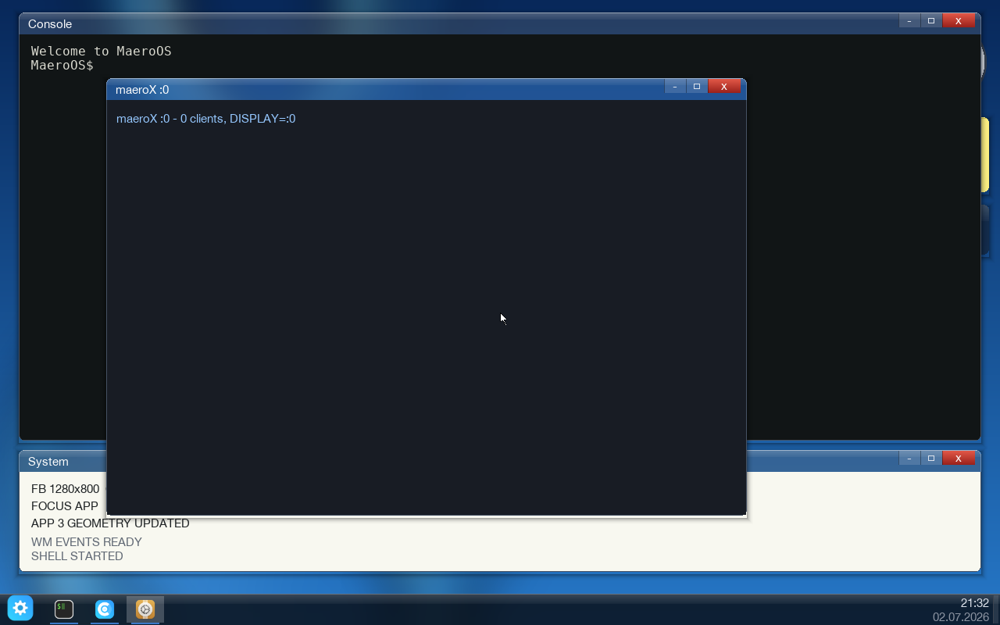

# MaeroOS

A 32-bit operating system written from scratch for i686: kernel, C library, userland,
window system and desktop. It boots under `qemu-system-i386` from a Multiboot kernel
image or a GRUB ISO, speaks the Linux i386 system-call ABI over `int 0x80`, and runs
real Linux i386 ELF binaries (static and dynamically linked) alongside its own programs.



The desktop at 1280x800, showing the native Console, the maeroX X11 server window
reporting `maeroX :0 - 0 clients, DISPLAY=:0`, and a System window with the current
framebuffer mode.

## Why it is unusual

- The kernel implements the **Linux i386 syscall table**, not a bespoke one.
  `proc/syscall.c` dispatches 176 Linux syscall numbers, so software built with an
  ordinary `i686-linux-musl` or `i686-linux-gnu` toolchain runs without patching.
- **Dynamic linking works.** The real musl `ld-musl-i386.so.1` loads PIEs and external
  shared objects, which is what makes prebuilt Linux packages usable at all.
- **SMP.** Application processors are booted through a real-mode trampoline and run
  threads under a recursive Big Kernel Lock with IPI-based TLB shootdown.
- **The X11 wire protocol.** `maeroX` is a native MaeroOS GUI application that acts as
  an X server on `/tmp/.X11-unix/X0`, and the genuine libX11/libxcb/Cairo/Pango/GTK3
  stack has been cross-built and run against it.

## Project status

What is proven by the automated QEMU tests in `tools/`:

| Area | Proof | Target |
|---|---|---|
| Boot, shell, procfs, PTYs, threads, shm, RNG | `ls`, `cat`, `sysprobe ok`, `shmprobe ok`, `threadprobe ok`, `ptytest ok`, `cttytest ok`, `/proc/self/status` | `make smoke` |
| toybox 0.8.13 as a static guest binary | `TOYBOX_OK` plus 17 applet checks | `make smoke-toybox` |
| Native coreutils-style commands | `uname`, `whoami`, `hostname`, `free`, `df`, `uptime`, `which` | `make smoke-cmds` |
| ext2 disk, login/passwd, init services, sessions | 108 assertions including `passwd: password updated for root` and `svc` state transitions | `make smoke-disk` |
| TCP/IP over lwIP and RTL8139 | `MAEROS_HTTP_OK` fetched from a host HTTP server | `make smoke-net` |
| Kernel firewall | rule drops the fetch, `/proc/firewall` shows a non-zero hit count, flush restores it | `make smoke-fw` |
| Dynamic linker | `DYNPROBE_OK` from a PIE loaded through musl `ld.so` | `make smoke-dyn` |
| External shared libraries and pthreads | `GREET_OK sum=42`, `ZLIB_OK ver=1.3`, `THREADS_OK count=200000`, `UNIX_SOCK_OK` | `make smoke-dynlib` |
| X11 server | `XHANDSHAKE_OK`, `XDRAW_OK` (`w=320 h=200` from `GetGeometry`), `XEVENT_OK`, and `XREAL_PAINTED` from a client linked against the cross-built libX11 | `make smoke-x` |
| GLib, Cairo, Pango, GTK3 | `GLIB_OK` (v2.78), `CAIRO_OK rect_px=0xe69919`, `PANGO_OK`, `GTK_OK init`, `GTK_WINDOW_SHOWN`, `GTK_DRAWN` | `make smoke-gtk` |

### What does not work

- **Firefox 115.15.0esr does not reach first paint.** The prebuilt i686 ESR build loads
  and `/disk/firefox/firefox-bin --version` prints `Mozilla Firefox 115.15.0esr`
  (`Makefile:224`), but the browser stalls during startup before rendering a page. Much
  of the Firefox-specific tracing left in `proc/syscall.c`, `proc/scheduler.c` and
  `proc/usocket.c` exists to chase that stall. This is the current frontier of the
  project, not a finished feature.
- **More than 512 MiB of RAM hangs at boot.** The physical and virtual memory managers
  need work before the 1 to 2 GiB that Gecko wants is usable. See `README-BROWSER.md`.
- **No W^X.** ELF segments are mapped writable; `proc/elf.c` does not yet enforce
  per-segment protection.
- **inotify is deliberately absent.** Numbers 291, 292, 293 and 332 return `-ENOSYS`
  on purpose so GLib falls back to its polling backend (`proc/syscall.c:6536`).
- **No SMP scaling.** One Big Kernel Lock serialises all kernel execution
  (`arch/i686/cpu/bkl.c`).
- **The host build is macOS-flavoured.** `make disk` calls Homebrew e2fsprogs at
  `/opt/homebrew/opt/e2fsprogs/sbin`, `make toybox` calls `gsed`, and `make start`
  auto-fits the guest resolution using `osascript`. These paths are hard-coded in the
  Makefile and in `tools/run-maeros.sh`.
- **Known repository gap.** The bare filename patterns in `.gitignore` (added to exclude
  built binaries in `testfiles/`) also match same-named source directories, so 67 of the
  103 source directories referenced by `userspace/Makefile` are currently untracked and
  will be missing from a fresh clone. `make userspace` therefore does not build from a
  clone yet. The kernel tree (`arch/`, `drivers/`, `fs/`, `include/`, `kernel/`, `lib/`,
  `mm/`, `net/`, `proc/`) is complete.

## What is in the box

### Kernel

- Multiboot 1 higher-half kernel: `arch/i686/boot/boot.asm` sets up paging before jumping
  to `0xC0000000`, `linker.ld` links the image at `KERNEL_VMA + 0x00100000`.
- Boot order lives in one readable function, `kernel_main` in `kernel/main.c`: serial,
  RTC, GDT/TSS/IDT/FPU, PIC, VGA, physical memory, paging, LAPIC, framebuffer, heap,
  VFS, initrd, PCI, network, ATA/ext2, tmpfs, devfs, procfs, scheduler, input, PIT,
  application processors, then `/disk/init` or `/init`.
- 21,612 lines of C, headers and assembly across the kernel directories, of which
  `proc/syscall.c` is 6,653.
- Limits in `include/kernel/config.h`: `MAX_PROCS` 128, `MAX_FD` 128, 32 KiB kernel
  stacks, a 256 MiB kernel heap window at `0xD0000000`, 64-page user stacks below
  `0xC0000000`.

### Memory

- `mm/pmm.c`: bitmap frame allocator with a per-frame `uint16_t` refcount array and a
  use-after-free detector that reports frames handed out with a stale refcount.
- `arch/i686/mm/paging.c`: recursive page-directory self-map at PDE 1023, copy-on-write
  fork, demand-paged anonymous VMAs, and an exception table (`__start___ex_table`) so a
  faulting `copy_from_user` returns `-EFAULT` instead of panicking.
- `mm/heap.c`: free-list allocator whose block headers carry a `0xDEADBEEF` magic that is
  checked on every access.

### Processes, threads and IPC

- `sys_clone` handles `CLONE_VM`, `CLONE_SETTLS` (per-thread TLS through GDT entry 6),
  `CLONE_PARENT_SETTID`, `CLONE_CHILD_SETTID` and `CLONE_CHILD_CLEARTID`, which is what
  makes `pthread_join` return.
- `futex` WAIT/WAKE backs musl mutexes and condition variables.
- `proc/usocket.c`: AF_UNIX stream sockets with `socketpair`, named bind/listen/connect,
  `sendmsg`/`recvmsg`, and `SCM_RIGHTS` file-descriptor passing integrated into `poll`
  and `select`. This is the transport X11 clients connect over.
- `proc/pipe.c` pipes and FIFOs, `proc/shm.c` shared memory, `proc/signal.c` signal
  delivery with a `sigcontext`/`ucontext` frame laid out exactly as glibc expects, so a
  handler can read `uc_mcontext`.
- `proc/elf.c` loads `ET_EXEC` and `ET_DYN`, records `PT_INTERP`, and hands control to the
  interpreter with a full aux vector (`AT_PHDR`, `AT_BASE`, `AT_ENTRY`, `AT_RANDOM`).

### SMP

`arch/i686/cpu/` holds the LAPIC driver (`apic.c`), AP startup through
`arch/i686/boot/ap_trampoline.asm` (`smp.c`), per-CPU scheduler state (`percpu.h`) and
the recursive Big Kernel Lock (`bkl.c`). A CPU spinning for the lock keeps servicing TLB
shootdown requests while it waits, because it holds interrupts off and would otherwise
deadlock the sender.

### Filesystems

`fs/vfs.c` mount table with a root overlay, `fs/initrd.c` ustar archive read from the
Multiboot module, `fs/ext2.c` (1,522 lines, read and write, mounted at `/disk` and
overlaid on `/`), `fs/tmpfs.c` at `/tmp`, `fs/devfs.c` at `/dev` (`null`, `zero`, `tty`,
`ptmx`, `pts/`, `random`, `urandom`, `fb0`, `dsp`, `shm`, `input/event0`, `input/event1`,
standard fd aliases), and `fs/procfs.c` at `/proc` (`self`, per-pid `status`, `stat`,
`statm`, `maps`, `fd`, `cmdline`, `environ`, `auxv`, `exe`, plus `meminfo`, `version`,
`uptime`, `cpuinfo`, `kmsg`, `processes`, `pci`, `netif`, `firewall`, `sys/vm/`).

### Networking

lwIP 2.2.1 is vendored at `third_party/lwip` and driven by `net/lwip_glue.c` over the
RTL8139 driver in `drivers/rtl8139.c`. DHCP runs at boot; `net/socket.c` implements the
BSD socket calls both through `socketcall` (102) and the direct i386 numbers 359 to 373;
`net/firewall.c` is a rule-based packet filter configured by `fwctl` and readable at
`/proc/firewall`; a kernel thread `knetd` (`net/net.c:105`) keeps timers and TCP alive
without userspace polling.

### Drivers

ATA PIO (`ata.c`), PCI enumeration (`pci.c`), RTL8139 (`rtl8139.c`), Intel 82801AA AC'97
audio (`ac97.c`), Multiboot VBE framebuffer (`framebuffer.c`), VGA text (`vga.c`), PS/2
keyboard and mouse (`keyboard.c`, `mouse.c`), CMOS RTC (`rtc.c`) and 16550 serial
(`serial.c`).

### Userland

`userspace/` holds its own freestanding libc (`libc/`, including `pthread.c`, `termios.c`,
`socket.c` and a DNS resolver), `init` with `/etc/rc`, `/etc/inittab` sessions and
`/etc/services` supervision, a shell, and the drawing stack `libdraw` / `libwm` /
`libgui`. `userspace/Makefile` builds 100 binaries into `testfiles/`: coreutils-style
commands, `login` / `passwd` / `doas` with PBKDF2-SHA256 password hashing, `svc`,
`session`, `getty`, `fwctl`, `ifconfig`, `lspci`, `dmesg`, `ps`, `top`, and a set of
`*probe` binaries that exist so the smoke tests can assert on their output.

### Desktop and window system

`desktop` draws the taskbar and wallpaper and manages windows through `libwm`; `term`,
`edit`, `calc`, `view`, `files`, `taskmgr`, `settings`, `store` and `browse` are native
GUI applications built on `libgui`. `maerox` is the X11 server: it owns a desktop window,
listens on the AF_UNIX socket `/tmp/.X11-unix/X0`, and answers the connection setup
(one screen, a 24-bit TrueColor visual) plus `CreateWindow`, `CreateGC`, `MapWindow`,
`PolyFillRectangle`, `PutImage` and `GetGeometry`, sending `Expose`, `ConfigureNotify`,
`ButtonPress` and `ButtonRelease` back to clients.

`store` and `pkg` install packages from a repository built by `tools/mkrepo.py` out of
`ports/packages/*/pkg.conf`; `make repo-serve` serves it over HTTP so the guest can fetch
from `10.0.2.2:8000`.

### Ports

Imported software is cross-built in a `i686-linux-musl` Docker container
(`ports/Dockerfile.cross`) and shipped on the ext2 disk: BusyBox 1.35.0, fbDOOM with the
shareware WAD, links 2.30 with framebuffer graphics, zlib, libpng, libjpeg, the
libX11/libxcb client stack (`ports/x11/build-x11.sh`), the GLib/Cairo/Pango/GTK3 stack
(`ports/gtk/`), and a prebuilt Firefox 115 ESR (`ports/firefox/`). The extracted trees and
the toolchain tarball are gitignored because they run to several gigabytes, so a fresh
clone will not contain them; the `ports/build-*.sh` scripts refetch and rebuild.

## Building and running

### Prerequisites

| Tool | Needed for |
|---|---|
| `i686-elf-gcc`, `i686-elf-ar`, `i686-elf-strip` | kernel and userland |
| `nasm` | assembly sources |
| `qemu-system-i386` | every `run*` and `smoke*` target |
| `grub-mkrescue` (or `i686-elf-grub-mkrescue`) and `xorriso` | `make iso`, and therefore the framebuffer desktop |
| `e2fsprogs` at `/opt/homebrew/opt/e2fsprogs/sbin` | `make disk` |
| `gsed` | `make toybox` |
| `python3` | smoke tests and the asset and repository generators |
| `docker` | rebuilding anything under `ports/` |

### Targets

```sh
make                # build kernel.elf
make initrd         # build userspace + toybox, pack testfiles/ into initrd.tar
make run            # QEMU -kernel boot, serial on stdio, 512 MiB
make run-net        # -kernel boot with an RTL8139 on QEMU user networking
make run-disk       # -kernel boot with the ext2 disk.img attached
make iso            # GRUB ISO (maeros.iso)
make run-iso        # boot the ISO
make start          # build disk + ISO + package repo and open the graphical desktop
make disk           # build a 384 MiB ext2 disk from testfiles/
make disk-ff        # build a 1 GiB disk that also carries the Firefox tree
make run-firefox    # boot with disk-ff.img and 2 GiB of RAM
make debug          # QEMU with -d int,cpu_reset logging to /tmp/qemu.log
make gdb            # QEMU frozen, waiting for gdb on :1234
make clean
```

`make run` uses QEMU's built-in Multiboot loader, which does not supply VBE framebuffer
information, so that path is serial and VGA text only. The graphical desktop needs the
GRUB path: `make run-iso`, or `make start`, which also picks a guest resolution that fits
the host screen and serves the package repository on port 8000.

Everything goes to the serial console, so `make run` gives you the boot log and the
`MaeroOS$` prompt in your terminal. The boot log is also readable inside the guest with
`dmesg` and at `/proc/kmsg`.

## Testing

The ten smoke targets each boot QEMU, drive the guest shell over the serial console and
assert on the output. They are the project's regression suite; `tools/smoke.py` is the
shortest one to read first.

```sh
make smoke          # boot, shell, procfs, PTYs, threads, shm, getrandom, ps
make smoke-cmds     # native uname/whoami/hostname/free/df/uptime/which
make smoke-toybox   # toybox as a static guest binary
make smoke-disk     # ext2, login/passwd, init sessions, service supervision, overlay
make smoke-net      # DHCP, TCP, HTTP GET from the host
make smoke-fw       # firewall rule blocks and unblocks that GET
make smoke-dyn      # PIE through the musl dynamic linker
make smoke-dynlib   # external .so files, zlib, pthreads, AF_UNIX
make smoke-x        # maeroX handshake, drawing and input events
make smoke-gtk      # GLib, Cairo, Pango and a real GTK3 window
```

Each script exits non-zero and prints the failing expectation, for example
`command 'threadprobe' did not produce 'threadprobe ok'`.

## Repository layout

| Path | Contents |
|---|---|
| `arch/i686/` | boot and AP trampoline assembly, GDT/IDT/TSS/PIC/PIT, LAPIC, SMP, BKL, paging |
| `drivers/` | ATA, PCI, RTL8139, AC'97, framebuffer, VGA, keyboard, mouse, RTC, serial |
| `fs/` | VFS, ustar initrd, ext2, tmpfs, devfs, procfs |
| `include/kernel/` | `config.h`, `types.h`, `multiboot.h`, `assert.h` |
| `kernel/` | `main.c`, `printk`, ring-buffer `klog`, `panic`, RNG, stack protector |
| `lib/` | freestanding `string` and `printf` |
| `mm/` | physical allocator, kernel heap, VMM helpers |
| `net/` | lwIP port and glue, sockets, firewall, `knetd` |
| `proc/` | scheduler, processes, ELF loader, syscalls, signals, pipes, AF_UNIX, shm |
| `userspace/` | libc, init, shell, libdraw/libwm/libgui, desktop, maeroX, commands |
| `ports/` | cross-build scripts, Dockerfiles and package recipes for imported software |
| `testfiles/` | the root filesystem staged into `initrd.tar` and `disk.img` |
| `third_party/` | vendored lwIP and toybox |
| `tools/` | smoke tests, QEMU launch script, icon/font/wallpaper/repo generators |
| `docs/` | screenshots |

## Architecture notes

- **Higher half at `0xC0000000`.** `boot.asm` identity-maps the first 12 MiB (PDE 0 to 2)
  and mirrors them at PDE 768 to 770 before enabling paging, then jumps to the virtual
  address and clears the identity entries for the first 8 MiB. User address space runs
  from 0 to `0xC0000000`.
- **Recursive page tables.** PDE 1023 points at the page directory itself, so any page
  table is reachable at `0xFFC00000 + (pde << 12)` without a temporary mapping.
- **Linux i386 ABI over `int 0x80`.** Arguments arrive in EBX, ECX, EDX, ESI, EDI, EBP,
  which is why `mmap2` reads its file offset from `regs->ebp`. The kernel adds four
  numbers of its own outside the Linux table, 500 to 502 for shared memory and 505 for
  the desktop kill target.
- **One Big Kernel Lock.** Application processors run user threads concurrently, but any
  CPU entering the kernel takes the recursive BKL. The first user process dispatched
  releases it in `forkret` on the way to user mode.
- **Boot filesystem then disk.** The initrd is a flat ustar archive that lives in RAM for
  the whole session, so the large GTK and Firefox trees are kept off it and shipped on
  the ext2 disk instead (`INITRD_EXCLUDE` in the Makefile). The disk is also overlaid on
  `/`, so writes to `/home` land on `/disk/home`.
- **maeroX speaks the X11 wire protocol** over AF_UNIX rather than emulating a toolkit,
  which is why the unmodified libX11 and libxcb from upstream work against it.

For the longer story of how the browser stack was built up, phase by phase, see
[README-BROWSER.md](README-BROWSER.md). For the planned direction, see
[ROADMAP.md](ROADMAP.md).

## Third-party code

| Component | Version | Location | License |
|---|---|---|---|
| lwIP | 2.2.1 | `third_party/lwip` | BSD 3-clause (`third_party/lwip/COPYING`) |
| toybox | 0.8.13 | `third_party/toybox` | 0BSD (`third_party/toybox/LICENSE`) |
| fbDOOM | id Software Doom source | `ports/fbDOOM` | GPL v2 |
| BusyBox | 1.35.0 | `ports/busybox`, `ports/packages/busybox` | GPL v2 |
| links | 2.30 | `ports/links-2.30.tar.gz`, `ports/packages/links` | GPL v2 |
| zlib, libpng, libjpeg | 1.3.1, 1.6.43, 9f | upstream tarballs in `ports/` | zlib, libpng and IJG terms |
| libX11 / libxcb, GLib, Cairo, Pango, GTK3 | built by `ports/x11` and `ports/gtk` | not vendored | upstream terms |
| Firefox ESR | 115.15.0 | fetched by `ports/firefox` | MPL 2.0 |
| Doom shareware WAD | `doom1.wad` | `ports/doom1.wad` | id Software shareware terms |

Each of these keeps its own license. Nothing in this list has been relicensed.

## License

No license has been chosen for MaeroOS itself yet, so there is no `LICENSE` file in this
repository. The vendored and imported components listed above remain under their own
licenses.
