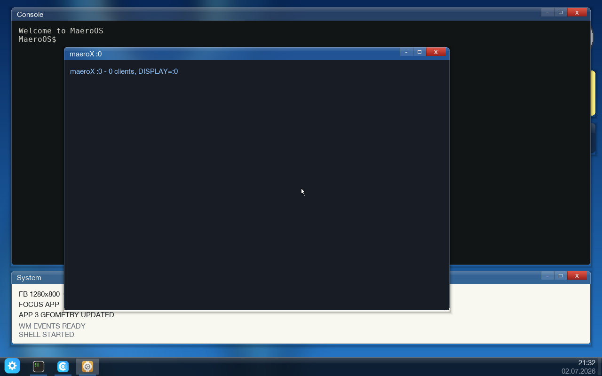

# MaeroOS

[](https://github.com/Maero47/MaeroOS/actions/workflows/ci.yml)

A 32-bit operating system written from scratch for i686: kernel, C library, userland,
window system and desktop. It boots under `qemu-system-i386` from a Multiboot kernel
image or a GRUB ISO, speaks the Linux i386 system-call ABI over `int 0x80`, and runs
real Linux i386 ELF binaries (static and dynamically linked) alongside its own programs.



The desktop at 1280x800. `Console` and `System` are the desktop's own built-in windows,
a fallback shell and an event log; `maeroX :0` is the X11 server running as an ordinary
desktop application and reporting `0 clients, DISPLAY=:0`.

## Why it is unusual

- The kernel implements the **Linux i386 syscall table**, not a bespoke one.
  `proc/syscall.c` dispatches the Linux syscall numbers software uses (`rseq` deliberately
  answers `ENOSYS`), so software built with an ordinary `i686-linux-musl` or
  `i686-linux-gnu` toolchain runs without patching.
- **Dynamic linking works.** The real musl `ld-musl-i386.so.1` loads PIEs and external
  shared objects, which is what makes prebuilt Linux packages usable at all.
- **SMP.** Application processors are booted through a real-mode trampoline and run
  threads under a recursive Big Kernel Lock; idle CPUs halt without taking it, and a TLB
  shootdown goes only to the CPUs running the address space that changed
  ([docs/smp-plan.md](docs/smp-plan.md)).
- **PAE paging with NX** on a 32-bit kernel: 64-bit page-table entries, execute
  protection (W^X) for user and kernel pages, and user pages in RAM above 4 GiB.
- **The X11 wire protocol.** `maeroX` is a native MaeroOS GUI application that acts as
  an X server on `/tmp/.X11-unix/X0`, including enough of the RENDER extension for Cairo
  to composite and for text to arrive as glyphs. The genuine libX11, libxcb, Cairo, Pango
  and GTK3 stack has been cross-built and run against it.

## Project status

What is proven by the automated QEMU tests in `tools/`:

| Area | Proof | Target |
|---|---|---|
| Boot, shell, procfs, PTYs, threads, shm, AF_UNIX, RNG, bad user pointers | `ls`, `cat`, `sysprobe ok`, `shmprobe ok`, `unixprobe ok` (stream, datagram and seqpacket sockets), `threadprobe ok`, `ptytest ok`, `cttytest ok`, `memprobe ok`, `wxprobe ok` (read-only text/rodata/mprotect'ed pages refuse writes, also after fork; with NX, code on the stack, the brk heap and an anonymous RW mapping dies of `SIGSEGV` until `mprotect(PROT_EXEC)`, and a JIT buffer flipped RW→RX runs), `/proc/self/status` | `make smoke` |
| toybox 0.8.13, syscall edge cases, signals, timers, libc, job control, `pkg` archive checks | `TOYBOX_OK` plus about 90 applet checks, `sysmiscprobe ok`, `abi2probe ok` (open modes, `O_APPEND`, groups, `access`), `sigexecprobe ok`, `sigshareprobe ok` (process-wide pending signals, group stop), `timerprobe ok` (`alarm`, `setitimer`, `timer_*`), `LIBCTEST PASS`, `^Z`/`jobs`/`fg` on a pipeline, `pkg` refusing `../etc`, and the host-side `tools/test_pkg_tarx.py`, `tools/test_pkg_sign.py` and `tools/test_regex.py` | `make smoke-toybox` |
| Native coreutils-style commands, user faults | `kwprobe ok` (a user write to kernel memory dies of SIGSEGV, a user `int3` of SIGTRAP), then `uname`, `whoami`, `hostname`, `free`, `df`, `uptime`, `which` | `make smoke-cmds` |
| ext2 disk, symlinks, login/passwd/doas, permissions, init services, sessions | 169 checks including `passwd` keeping `/etc/shadow` root-only 0600, `login` dropping to `uid=1000`, `doas` ignoring a planted `./ls`, `credprobe ok`, `fsprobe ok`, `symprobe ok` (ext2 symlinks, checked on the image with `debugfs` too) and `svc` state transitions | `make smoke-disk` |
| SATA AHCI disk (pc + `-device ahci`, then `-M q35`), no IDE disk | `/disk` mounted from `ahci0`, `diskprobe ok`, `fsprobe ok`, `symprobe ok`, a 3 MiB random file read and copied with matching md5 in the guest and on the host (`debugfs`), persistence across a reboot onto q35, `e2fsck -fn` showing no new damage, `reboot`/`poweroff` ending QEMU | `make smoke-ahci` |
| NVMe disk (pc + `-device nvme`, then `-M q35` with MDTS=2 and two namespaces), no IDE/AHCI disk | `/disk` mounted from `nvme0`, both namespaces found, `diskprobe ok`, `fsprobe ok`, a 3 MiB random file read and copied with matching md5 in the guest and on the host, transfers using PRP lists and split at MDTS (driver counters at shutdown), persistence across a reboot, `e2fsck -fn` clean of new damage, `reboot`/`poweroff` ending QEMU | `make smoke-nvme` |
| `mount`/`umount`, partitions, read-only ext4 | busybox `mount -t ext4 /dev/hdb2 /mnt` on a GPT disk (4 KiB blocks, `64bit`, `metadata_csum`, `huge_file`, `flex_bg`) and `/dev/hdc5` on an MBR logical partition (1 KiB blocks): md5 of every file equals the host's, including a 300 MiB sparse file and an unwritten extent; a 5020-entry and a 20000-entry (two-level) htree directory list and resolve completely; fast, slow, relative, absolute and directory symlinks; writes fail with `EROFS`; `umount` is refused while a cwd is inside; tmpfs `remount,ro`; non-root `mount` refused; afterwards both filesystems are byte-identical to their images and `e2fsck -fn` is clean; on q35 the same partitions are found and mounted from AHCI (`/dev/sdb2`) and NVMe (`/dev/nvme0n1p5`) | `make smoke-ext4` |
| Read-write FAT12/16/32 (vfat), USB sticks | volumes made on the host with `mkfs.fat` and `mtools` (long and Turkish names, a 300-entry directory, a 5 MiB file): mounted read-write with busybox `mount -t vfat` from AHCI (`/dev/sdb1`, MBR), a QEMU `usb-storage` stick without a partition table (`/dev/sdd`, mounted without `-t`) and IDE (`/dev/hdb1`); every file's md5 matches; mkdir, create, a 5 MiB copy, a directory that grows to 150 long-name entries, append, write past the end, truncate, renames (across directories, a directory with contents, over an existing file, case-only), unlink, `rm -r`, rmdir; `df` accounting; a file unlinked while open; `ENOSPC` on a full FAT12 volume; `remount,ro`/`rw`; the stick unplugged while mounted and plugged back in; raw writes to `/dev/sdd` and to `/dev/sdc` (whose partitions are mounted) refused with `EBUSY` and `maeros-install -l` marking the mounted stick in use; `poweroff` with the stick still mounted; afterwards `fsck.fat -n` is clean on every volume and `mtools` on the host sees exactly the guest's files and contents | `make smoke-vfat` |
| Read-write exFAT | volumes made with `mkfs.exfat` and filled by `tools/exfatimg.py`: an MBR partition on AHCI, a USB stick without a partition table and a 64 GiB sparse disk with 4096-byte sectors and a 5 GiB file; every md5 matches (contiguous, FAT-chain and ValidDataLength < DataLength files, Turkish and non-BMP names, case-insensitive lookups through the up-case table); create, append (contiguous files turning into FAT chains), truncate both ways, every rename case, unlink, `rm -r`, a growing directory, statfs, unlink-while-open, ro/remount; a marker written at 4 GiB − 8 KiB of the 5 GiB file; `poweroff` with two volumes mounted; afterwards `fsck.exfat -n` is clean and an independent checker finds exactly the guest's files, checksums, hashes and bitmap; crafted entry sets, boot regions, up-case table and fuzzed volumes are refused or read without a crash | `make smoke-exfat` |
| Files past 4 GiB | sparse ext4, ext2 (block-mapped: triply indirect) and exFAT disks: a static musl probe writes across 4 GiB and past 8 GiB, reads back through `read`, `pread64` and `mmap2`, checks `stat64`/`statx` sizes, `ftruncate64` below 4 GiB and up to 9 GiB, `F_SETLK64` locks at 5 GiB against a child, `copy_file_range`/`sendfile64`, and `EOVERFLOW` from the 32-bit `lseek`/`open`/`stat`/`sendfile`/`F_GETLK`; busybox `dd`/`cmp`/`truncate` markers at 4 and 8 GiB; vfat answers `EFBIG` at 4 GiB − 1; after `poweroff` e2fsck/debugfs, fsck.exfat + an independent reader (md5 of all 9 GiB) and fsck.fat agree | `make smoke-largefile` |
| ext2 read-write beyond `/disk` | on q35, an ext2 partition on AHCI (`/dev/sdb1`, 1 KiB blocks) and an ext3 with an htree directory on NVMe (`mount -t ext4 /dev/nvme0n1`, 4 KiB blocks) mounted read-write at the same time: files read back, `df` reports each filesystem, create/append/mkdir/symlink/rename/unlink/rmdir on both, a 2 MiB file in double-indirect blocks, copy and move between them, hard link across them refused; the same device again, raw `/dev` writes to it or its disk, and `umount` with a file open are `EBUSY`; `remount,ro` refuses writes and `remount,rw` allows them; everything survives umount and a second mount; `-o ro` through the ext2 driver; `needs_recovery` refused read-only and replayed (an empty journal) by a read-write mount; `/disk` unaffected; after `poweroff`, host `e2fsck -fn` is clean on both, the superblocks say clean, `debugfs` sees every change | `make smoke-ext2rw` |
| ext4 read-write with jbd2 | on q35, `mkfs.ext4` defaults (journal, extents, `64bit`, `flex_bg`, `metadata_csum`, `orphan_file`; 4 KiB blocks, a 1200-entry htree directory) on AHCI and `mkfs.ext4 -O ^has_journal` (1 KiB blocks) on NVMe mounted read-write together: create/mkdir/rename (in and across directories, over an existing file)/unlink/rmdir, fast and slow symlinks, a file of eleven extents with a hole filled in the middle (a depth-1 extent tree), a 10 MiB sparse file, a 1000-entry directory, truncate down and back up, a 50 MiB file, 600 names added to the htree directory (leaf splits) and 2000 to a 1 KiB-block one (the root fills and a second index level appears); a new directory grown to 5000 names becomes indexed, and 10000-name directories with and without `dir_index` are created and looked up with timings printed (the indexed one at least 3x faster); all of it survives umount and a second mount; a `needs_recovery` image whose journal (checksum v3) holds a transaction written by `debugfs` is refused read-only and replayed by a read-write mount; `mount -o x4crash` stops after a commit as if the power had gone; `poweroff` with both mounted; afterwards host `e2fsck -fn` is clean (no checksum errors) and the superblocks clean without `needs_recovery`, `debugfs` sees every change, the depth-1 extent tree and both directories still indexed, `e2fsck` replays the journal the guest left behind, and a second boot has this driver replay a copy of it; power lost with a file open and unlinked (orphan file), in the middle of freeing a file on a filesystem without `orphan_file` (old orphan list) and in the middle of a truncate: the next mount deletes the first two and cuts the third to its new size, and `e2fsck -fn` is clean | `make smoke-ext4rw` |
| Installing to a disk (`maeros-install`) | from the Limine live ISO on q35 with the live `disk.img` as `sda` and an empty 1 GiB `sdb`: `maeros-install -l` lists both and marks `sda` in use, installing over `sda` is refused, `maeros-install -y /dev/sdb` writes a GPT (BIOS boot, FAT32 ESP, ext4 root with journal, extents, `flex_bg`, `metadata_csum`, `dir_index`, `orphan_file`) and Limine; on the host `sgdisk -v`, `e2fsck -fn` and `fsck.fat -n` are clean; then the installed disk alone boots under SeaBIOS and OVMF x64: Limine passes `root=PARTUUID=...`, `/dev/sda3` is `/disk` (ext4, journaled, marked clean at poweroff), login and the desktop work, the ESP (`/dev/sda2`) mounts with the vfat driver and its `limine.conf` names the booted root, and a file written in the first boot is there in the second; afterwards `e2fsck -fn` is clean again | `make smoke-install` |
| `pkg` and the signed repo index | `tools/test_pkg_sign.py` runs the RFC 8032 vectors through the Python signer and the C verifier and rejects altered, unsigned and foreign-key indexes; in the guest, `pkg update` rejects unsigned, tampered and rolled-back indexes, installs and runs busybox, and `install` rejects a tarball whose SHA-256 does not match | `make smoke-pkg` |
| TCP/IP over lwIP and RTL8139 | `MAEROS_HTTP_OK` fetched from a host HTTP server; `sockprobe` checks that `send` after `shutdown(SHUT_WR)` fails with `EPIPE`, a two-step shutdown ends in a FIN and no RST, closing TIME_WAIT sockets keeps TCP working, and a non-blocking client gets `EINPROGRESS`, `SO_ERROR`, `EAGAIN`, `ECONNREFUSED` and both socket names; `abi2probe net` checks `MSG_NOSIGNAL` and `EPIPE` after a reset | `make smoke-net` |
| Loopback and IPv6 | SLAAC on eth0 (QEMU user-net `fec0::/64`) in `/proc/net/if_inet6`. A guest TCP server on `127.0.0.1` and `[::1]` is reached by a guest client, an `AF_INET6` listener on `[::]` accepts an IPv4 client as `::ffff:127.0.0.1`, an `IPV6_V6ONLY` one refuses it, UDP runs over `::1`, and ICMP echo to `127.0.0.1` and `::1` works over ping sockets. `toybox wget` fetches from a host server at `http://[fec0::2]:port/`, `getaddrinfo` of a dual-stack name returns A and AAAA in RFC 6724 order, and an any-address firewall rule blocks an IPv6 connect | `make smoke-net6` |
| Intel e1000, DHCP DNS, name resolution | the same suite on an e1000; the DHCP lease's DNS server is in `/etc/resolv.conf`; against a DNS responder in the harness, `getent` resolves A, AAAA, a CNAME, a PTR and an NXDOMAIN, `/etc/hosts` wins over DNS, and `httpget`, `toybox wget` and `toybox nc` connect by name | `make smoke-net-e1000` |
| virtio-net | QEMU `virtio-net-pci` booted three times: MSI-X, INTx (`vectors=0`) and the legacy interface (`disable-modern=on`); DHCP and `/etc/resolv.conf`, DNS lookups and `wget`/`httpget`/`nc` by name, a 1 MiB `wget` checked by md5, guest TCP and UDP servers reached through `hostfwd`, SLAAC and `wget` over IPv6, `ping` to `127.0.0.1` and `::1`, eth0 as ifindex 2; QEMU's `query-rx-filter` shows all-multicast and no promiscuous mode, `set_link` off/on reaches the guest as configuration interrupts; 50 MiB each way over TCP with the rate printed | `make smoke-net-virtio` |
| AF_INET server sockets | through QEMU `hostfwd`: `toybox nc -l -p 8080` exchanges a line each way with a host client; `srvprobe tcp` checks non-blocking `accept` (`EAGAIN`), `SO_RCVTIMEO` on `accept`, `poll` and `epoll` on a listener, three host clients queued in the backlog at once and taken with `accept4(SOCK_NONBLOCK\|SOCK_CLOEXEC)`, both socket names of an accepted connection, `EADDRINUSE` and then a `SO_REUSEADDR` rebind over TIME_WAIT, and `shutdown` of a listener; `srvprobe udp` checks a blocking `recvfrom` that `SO_RCVTIMEO` ends with `EAGAIN` and one that waits for the host's datagram | `make smoke-tcpsrv` |
| Kernel firewall | after `fwctl enable` plus a drop rule the same fetch fails, `fwctl list` reports the firewall `enabled` with the `drop out tcp` rule, malformed rules (`/33`, an overflowing prefix, port 70000, `tcpp`) are rejected under `policy out drop`, and `fwctl flush` restores the fetch | `make smoke-fw` |
| Dynamic linker | `DYNPROBE_OK` from a PIE loaded through musl `ld.so`; `WXPIE_OK` (the PIE's text and RELRO, libc's text and a `PROT_READ\|PROT_EXEC` library mapping are read-only) | `make smoke-dyn` |
| External shared libraries and pthreads | `GREET_OK sum=42`, `ZLIB_OK ver=1.3`, `THREADS_OK count=200000`, `UNIX_SOCK_OK` | `make smoke-dynlib` |
| X11 server | `XHANDSHAKE_OK`, `XDRAW_OK` (`w=320 h=200` from `GetGeometry`), `XEVENT_OK`, and `XREAL_PAINTED` from a client linked against the cross-built libX11 | `make smoke-x` |
| Desktop and its apps | driven with QMP mouse and keyboard input on the ISO: the launcher opens the terminal, a command typed into it runs in the terminal's own shell (its pid is checked), the pty reports the terminal's grid size, `vi` edits and writes a file inside it, maximizing the terminal grows its grid and the pty size, the image viewer shows `/disk/wallpaper.ppm`, Files enters a directory by double-click, then copies and pastes a file into a folder, renames it, deletes it after the confirmation, makes a folder and shows hidden files (each checked on disk), the editor copies and pastes through the desktop clipboard, finds text, saves, and asks before closing with unsaved changes, Settings applies an accent, the Turkish Q layout, a 12-hour clock and UTC+3 (the desktop reloads, `desktop.conf` changes, the taskbar clock is checked against the host's UTC time), Turkish letters typed into the editor are saved as UTF-8, the Store shows its verified list or the "run pkg update" state, the Task Manager lists the desktop and the Store, windows close by button, Esc and Alt-Tab and the focus passes to the topmost window left; every window must also show up in a screendump | `make smoke-gui` |
| GLib, Cairo, Pango, GTK3 | `GLIB_OK` (v2.78), `CAIRO_OK rect_px=0xe69919`, `PANGO_OK`, `GTK_OK init`, `GTK_WINDOW_SHOWN`, `GTK_DRAWN` (needs probe binaries a fresh clone lacks, see Testing) | `make smoke-gtk` |
| Intel HDA audio | on 2 CPUs, `tone` plays 1 kHz for 1.5 s and 2.5 kHz at 25 % mixer volume through `/dev/dsp`; QEMU's wav capture must hold each tone at its frequency, for about its length without dropouts, and the second one quieter; probe p77 drives the ALSA mixer elements (Master Playback Volume / Switch) through the control ioctls and checks the OSS mixer sees the same volume | `make smoke-hda` |
| USB audio (xHCI isochronous) | QEMU's `usb-audio` (UAC1, full speed) on a `qemu-xhci` next to an HDA card: it becomes ALSA card 1 (`/dev/snd/pcmC1D0p`) with a Feature Unit volume; `tone -c 1` plays 440 Hz for 2 s and 1 kHz at 30 % through the raw PCM ioctls, carried by one isochronous TD per 1 ms frame, and QEMU's wav capture must hold both at their frequencies and lengths with at most a few dropout blocks (0 in practice), the second quieter; `mixer -c 0/1` reads and sets both cards' Master volume and switch; the device unplugged (QMP) in the middle of a tone: the card leaves `/dev/snd`, the player fails instead of hanging, no panic; plugged back in, it plays again | `make smoke-usbaudio` |
| Sound for Linux programs (ALSA ABI) | Alpine's unmodified `aplay` (alsa-utils 1.2.14) in the chroot plays a 44.1 kHz mono S16 WAV through alsa-lib's `default` device and 22.05 kHz U8 and 48 kHz float WAVs through `hw:0`, then `tone` plays through `/dev/dsp`; QEMU's wav capture holds each tone at its frequency (DFT peak and zero crossings), for its length, without dropouts; Alpine's `amixer -c 0` reads the HDA card's Master and sets it (50 %, mute, unmute); `aplay -D hw:1` plays the 44.1 kHz WAV on a USB audio card, checked in its own capture; the same on AC'97 with `--ac97` (docs/audio.md; needs `disk-alpine.img`) | `make smoke-audio` |
| ACPI (uACPI 6.1.0) | on QEMU's `pc` and `q35` machines the kernel finds the RSDP, loads the AML namespace (`[ACPI] ready`), `poweroff` ends QEMU through S5 (`\_PTS`, `\_S5`), `reboot` restarts it through the FADT reset register (q35) or 0xCF9 (pc, whose FADT has none), and the ACPI power button (`system_powerdown`) reaches init as SIGUSR2 and powers off | `make smoke-acpi` |
| PC without legacy devices | `-M q35,i8042=off -smp 2` with an ICH9 HDA: no PS/2 controller (`[KBD]  no PS/2 controller`), `/disk` from `ahci0`, both CPUs from the MADT, the desktop's Terminal opened and typed into with a USB tablet and keyboard, and `doas poweroff` typed there makes QEMU exit through S5 | `make smoke-pc` |
| USB input and storage (xHCI) | the desktop driven with only a `usb-kbd` and `usb-tablet` on a `qemu-xhci`: the Terminal opens and a `doas login root` typed on the USB keyboard reaches a root shell, tablet clicks land where sent, a held key repeats, a `usb-mouse` behind a `usb-hub` moves the pointer, the xHCI on MSI-X interrupts; two FAT `usb-storage` sticks (one behind the hub at full speed, one on a root port at SuperSpeed) mounted at once with a file copied each way, the first also read and written raw through its `/dev/usbdiskN` (checksummed against the image); a two-LUN `usb-bot` as two disks; Caps Lock sets the keyboard's LED by SET_REPORT; Volume Down, Up and Mute on the keyboard set the HDA card's ALSA Master volume and switch through the desktop; a `usb-uas` disk on a SuperSpeed port runs USB Attached SCSI with streams (mounted vfat, read and written, checked in the image); the SuperSpeed stick unplugged and plugged back in five times under a looping reader without errors or leaked devices; idle kusbd CPU reported (smoke-pc runs the xHCI on its INTx line) | `make smoke-usb` |
| UEFI and BIOS boot (Limine, Multiboot 2) | `maeros-limine.iso` under SeaBIOS, OVMF x64 and OVMF IA32: the kernel sees Multiboot 2 from Limine on the expected firmware with an ACPI RSDP tag, the framebuffer (VBE or GOP) comes from the boot info, login works, the desktop starts and a screendump is that size and not blank, and `poweroff` exits through S5 (a firmware that is not installed is reported as SKIP) | `make smoke-uefi` |
| Display modes (Bochs DISPI, virtio-gpu) | Settings -> Display driven with QMP clicks on `-vga std` and on `virtio-vga`: the mode list comes from the expected driver and holds 1024x768, 1280x800 and 1920x1080; Apply switches (screendump size, colour count, the orb at the new bottom opens the launcher), Revert and the 15 s timeout go back, Keep stays and writes `mode=` to `desktop.conf`, which the next login applies; on virtio the desktop's flushes cover only its damage; the Limine ISO on OVMF with `ramfb` keeps its one fixed GOP mode | `make smoke-gfxmode` |
| /proc, System V IPC, utmp, inotify | busybox `ps`/`top`/`free`/`uptime` and toybox `ps`/`top`/`free`/`uptime`/`vmstat`/`pgrep`/`killall` read `/proc/stat`, `/proc/loadavg` and `/proc/<pid>`; toybox `who`/`w`/`last` show the console logins from utmp/wtmp; SysV shm/sem/msg between processes with permissions, `IPC_RMID` and `SEM_UNDO` (p46); inotify events on tmpfs and ext2 (p47); another user's `/proc/<pid>` `environ`, `fd/` and links are refused (p48). `SMOKE_PROCIPC_ARGS=--alpine` adds Alpine's procps-ng and htop | `make smoke-procipc` |
| Linux ABI conformance | 52 musl-built probes (`ports/abiprobes/`), each printing the same `PASS` on Linux, covering findings of the Firefox audit plus later additions: `splice`, `flock`/`fcntl` record locks, `renameat2`, rtnetlink, `/proc/<pid>/fd` link permissions, seccomp filters, System V IPC and inotify among them; any `FAIL`, missing verdict or wedge fails the run | `make smoke-abi` |
| Firefox 115.15.0esr | `ff: Firefox painted` (the browser window, about 1.7 s after `firefox-bin` starts); with `--web`, a page served from the host (HTML, a CSS rule, a PNG) requested and its image on screen about 3 s after Enter, and with `--fonts` the same page also carries CJK, Devanagari, Bengali, Tamil, Arabic, Hebrew and emoji text that must show no missing-glyph box in sans-serif or serif, with the emoji in colour; all fail unless about:support reports the content sandbox on (level 4 in the test profile, seccomp-bpf with TSYNC) with no syscall refused (`docs/sandbox.md`; needs the Firefox tree, see `ports/firefox/`) | `make smoke-firefox`, `make smoke-firefox-web`, `make smoke-firefox-fonts` |
| Alpine Linux x86 userland (chroot) | Alpine 3.22 (apk-tools 2) and 3.24 (apk-tools 3) roots from pinned, signature-checked packages, run with `chroot /disk/alpine`: `bash -c 'echo ok'`, GNU `ls --version`, `python3 -c 'print(1+1)'`, `vim --version`, `git init/commit/log`, `ssh -V`, `less` on a pipe, `apk add tree` / `apk del tree` from an offline repo on the disk, `apk verify`, and no unimplemented syscall on the way; `--net` also installs from a host-served HTTP mirror (needs network on the build host the first time, see `ports/alpine/`) | `make smoke-alpine` |
| Alpine networking and sshd (chroot) | In the Alpine chroot on an e1000: busybox `ip addr`/`ip route`/`ip link` (rtnetlink), `ifconfig` and `route -n` (SIOC* ioctls, `/proc/net/route`) show eth0's DHCP address and the default route; `udhcpc -i eth0 -n -q` gets a lease over `AF_PACKET` and its script reconfigures eth0 through rtnetlink; `ping` over a raw ICMP socket; `flock -n` fails while another process holds the lock and a blocking `flock` waits, and `apk` refuses to run while its database lock is held; `openssh-server` installed with `apk` from the offline repo, `ssh-keygen -A`, `sshd` on port 22, and the host logs in through hostfwd with a throwaway key (`ssh ... true`, a command, an interactive `ssh -tt` session on `/dev/pts/0`); no unimplemented syscall. Needs `ssh` on the host | `make smoke-alpine-net` |
| SMP locking (not in `make check`) | `-smp 4`: a `KLOCK_TEST` kernel's torture threads run a spinlock and a mutex outside the BKL on several CPUs at once without a lost update, and the lock-order checker catches one deliberate inversion; two fork+exec loops, pipelines, mmap/stat loops and `tar \| gzip` run together for 180 s without a hang, panic, kwatch STALL or lockdep report | `make smoke-klock`, `make stress-smp` |

### What does not work

- **Firefox 115.15.0esr is usable, not finished.** The prebuilt i686 ESR build paints
  its window and loads pages over HTTP and HTTPS (a real `https://example.com` loads
  through QEMU's user network, DNS and TLS included; DejaVu and Noto fonts cover Latin,
  Greek, Cyrillic, CJK, Devanagari, Bengali, Tamil, Arabic and Hebrew, and emoji are
  Firefox's colour Twemoji), but: the
  content sandbox runs at level 4 but without user namespaces, so Firefox skips
  its chroot and network/PID namespaces (`docs/sandbox.md`); scripts outside that
  set (Thai, Ethiopic, ...) are still missing-glyph boxes; and `ff` has to bring
  its own profile (`testfiles/ffprofile`) that turns off first-run dialogs, telemetry
  and add-on scans. `docs/audit/firefox-first-paint.md` and `docs/perf/firefox-startup.md` record how it
  got here.
- **Firefox sound is only checked by an opt-in run.** `<audio>` reaches the sound
  card through cubeb's PulseAudio backend, apulse and the kernel's ALSA ABI
  (`docs/audio.md`). On the current tree `smoke_firefox.py --audio` passes: in three
  runs the 3 s, 440 Hz clip was captured for 2.99-3.00 s with 5 silent 10 ms blocks
  inside, and in one run on the vruntime scheduler with 2. It is not part of `make check`, and only that one clip has been tried.
- **Execute protection needs PAE and NX in the CPU.** With both (`-cpu qemu32,+nx`,
  which every smoke suite uses, or any x86-64 CPU), user stacks, heaps, anonymous and
  shm mappings are non-executable and `mprotect(PROT_EXEC)` toggles it. QEMU's default
  `qemu32` model has PAE but no NX, so there the kernel runs PAE without execute
  protection; a CPU without PAE (`-cpu qemu32,-pae`) gets the old 2-level page tables.
  `nonx` on the kernel command line turns NX off. Write protection is enforced in
  every mode: `proc/elf.c` maps each `PT_LOAD` segment with its own `p_flags`, `ld.so`
  can `mprotect` a `PT_GNU_RELRO` range read-only, and a write to a read-only page is
  `SIGSEGV` (`SEGV_ACCERR`), in a forked child as well.
- **inotify reports through the VFS, not per dentry.** `fs/inotify.c` sees
  creates, unlinks, renames, attribute changes, writes and closes made through the
  VFS and the syscalls; an event about a file reaches its directory's watches through
  the directory its last path lookup went through, so an `fchmod` or a write on a
  descriptor whose file was renamed away reaches only the file's own watches.
  `IN_OPEN`, `IN_ACCESS` and `IN_UNMOUNT` are never generated (`docs/procipc.md`).
- **Unfinished credential and socket semantics.** `setfsuid`/`setfsgid` just report
  the effective id; a path lookup does not check search permission on the directories
  it walks through. `SO_LINGER` only acts with a zero timeout (`close()` sends a
  reset). A non-zero linger does not make `close()` wait.
- **One repo signing key per build host.** `index.txt` is Ed25519-signed and `pkg`
  checks it, but the key is created per host (`~/.config/maeros/repo-signing.key`) and
  its public half is compiled into `pkg`: a repo and a `pkg` built on different hosts,
  or across a key change, do not work together. There is no key rotation or revocation,
  and the rollback check is only as strong as the cached index, which the desktop user
  owns.
- **Little SMP scaling in the kernel.** One Big Kernel Lock still serialises kernel
  execution (`arch/i686/cpu/bkl.c`). Stage 1 of the plan in `docs/smp-plan.md` stopped
  idle CPUs and console output from paying for it: on `-smp 4` a single process's
  pipe, stat and mmap loops now run at the `-smp 1` rate, and fork+exec is 17× faster,
  but four processes in the kernel at once still spend most of their time spinning
  (pipe ×4: 0.82 M ops/s against 1.26 M on one CPU).
- **Hardware coverage is what QEMU emulates.** Every driver is tested against QEMU's
  device models only (the Realtek r8169 driver, which QEMU cannot emulate, is
  tested on the host against a simulated chip: `docs/r8169.md`). There is no
  Wi-Fi, no virtio device other than virtio-net and virtio-gpu (2D) (`docs/virtio.md`),
  no GPU acceleration (the desktop composites in software; mode setting exists for the
  Bochs/QEMU std VGA, VirtualBox VGA and virtio-gpu, other cards keep the boot loader's mode), no ACPI sleep states
  (only S5 power-off), and USB 3 hubs are untested (QEMU has none).
- **ext4 writes cover what `mkfs.ext4` makes, not every feature.** The ext2 driver
  mounts ext2, ext3 and a default ext4 (extents, `64bit`, `flex_bg`, `metadata_csum`)
  read-write, with jbd2 journaling (ordered mode, 1 s commits) and journal replay;
  `meta_bg`, `inline_data`, `encrypt`, `casefold`, `bigalloc`, quotas and filesystems of
  2^32 blocks or more stay read-only (busybox `mount` falls back to the read-only ext4
  driver). Directories are indexed (htree) once they outgrow one block and looked up
  through the index; files unlinked while open, and deletes and truncates spanning several
  journal commits, are recorded in the orphan file (or the old `s_last_orphan` list) and
  finished at the next mount (`docs/ext4.md`). FAT volumes are writable too
  (`mount -t vfat`, `docs/vfat.md`), and so are exFAT volumes (`mount -t exfat`,
  `docs/exfat.md`). File offsets are 64-bit (`docs/largefile.md`); FAT files
  stop at 4 GiB − 1 (`EFBIG`) and tmpfs files at 1 GiB.
- **Process accounting is approximate.** `/proc/stat` splits each CPU's busy time
  into user and system by timer-tick samples and has no iowait, irq or steal time;
  page-fault counters and `pgpgin`/`pgpgout` are 0 (`docs/procipc.md`). busybox
  `who` (musl) has no utmp support; toybox `who`, `w` and `last` read it. IPv6 is SLAAC only
  (no DHCPv6, no static IPv6 addresses), and the native resolver reads only IPv4
  `nameserver` lines (`docs/net.md`).
- **Only Linux and macOS hosts are covered.** The Makefile looks up `mke2fs`, `debugfs`
  and GNU `sed` on `PATH` (with the Homebrew locations as a fallback) and
  `tools/run-maeros.sh` picks the QEMU display, audio and screen-size probes per host,
  but nothing has been tried on Windows or the BSDs.

### Security notes

- **Default passwords.** `testfiles/etc/shadow` is committed with `root`/`root` and
  `user`/`user` (PBKDF2 hashes), so every image built from the tree has them, and the
  desktop runs as `user` without asking. Change them with `passwd` on anything that
  is reachable from a network.
- What is enforced: per-segment write protection, execute protection on CPUs with
  PAE and NX (see above), file and credential checks, guarded kernel stacks, a signed
  package index, raw writes to a disk with a mounted filesystem refused (`EBUSY`), and
  a maeroX that validates every request length and has no key-injection channel in the
  desktop build.
- What is not: the namespace part of the Firefox content sandbox (seccomp-bpf
  filtering and the file broker are on, `docs/sandbox.md`), execute protection on CPUs without NX,
  search permission on path lookups, and repo-key rotation (all under "What does not
  work").

## What is in the box

### Kernel

- Multiboot 1 and Multiboot 2 higher-half kernel: `arch/i686/boot/boot.asm` sets up
  paging (PAE when CPUID reports it, else 2-level) before jumping to `0xC0000000`,
  `linker.ld` links the image at `KERNEL_VMA + 0x00100000`.
- Boot order lives in one readable function, `kernel_main` in `kernel/main.c`: serial,
  RTC, GDT/TSS/IDT/FPU, PIC, VGA, physical memory, RNG, paging, LAPIC, framebuffer,
  heap, VFS, initrd, network, PCI and its drivers (mode-setting display, NICs, AC'97, xHCI, HDA, ALSA), the
  disks (ATA, AHCI, NVMe, the block-device table and partitions) and ext2, tmpfs,
  devfs, procfs, scheduler, input, PIT, TSC, ACPI, application processors, kernel
  threads, then `/disk/init` or `/init`.
- About 66,800 lines of C, headers and assembly in `arch/`, `drivers/`, `fs/`,
  `kernel/`, `lib/`, `mm/`, `net/`, `proc/` and `include/` (vendored code not counted),
  of which `proc/syscall.c` is about 10,900.
- Limits in `include/kernel/config.h`: `MAX_PROCS` 256, `MAX_FD` 512, 32 KiB kernel
  stacks, a 256 MiB kernel heap window at `0xD0000000`, 64-page user stacks below
  `0xC0000000`.
- Kernel stacks (`mm/kstack.c`) live outside the heap in 512 slots at `0xF0000000`,
  each below a 32 KiB unmapped guard, so an overflow faults instead of corrupting a
  neighbour. A double fault switches to a per-CPU task with its own stack
  (`arch/i686/cpu/dfault.c`) and reports over serial instead of resetting the machine.

### Memory

- `mm/pmm.c`: bitmap frame allocator with a per-frame `uint16_t` refcount array and a
  use-after-free detector that reports frames handed out with a stale refcount. It
  sizes itself from the boot memory map, up to 16 GiB under PAE, in two zones: frames
  the kernel holds a 32-bit address of (page tables, heap, DMA, page cache, shm, tmpfs)
  stay below 4 GiB, and private user pages prefer frames above it. Booted by hand with
  `-m 6G`, `/proc/meminfo` shows `HighTotal` 3 GiB, `HighFree` drops as programs run,
  and `memprobe`, `threadprobe` and `wxprobe` pass; no suite runs with more than 2 GiB.
- `arch/i686/mm/paging.c`: 64-bit page-table entries in either mode, PAE (3-level, NX
  in bit 63) or legacy 2-level, chosen at boot; a recursive mapping (PAE: the four page
  directories at `0xFFFFC000`, the tables from `0xFF800000`; legacy: PDE 1023),
  copy-on-write fork, demand-paged anonymous VMAs, and an exception table (`__start___ex_table`) so a
  faulting `copy_from_user`/`copy_to_user` (`proc/syscall.c`) returns `-EFAULT` instead
  of panicking. The kernel touches user memory only through these copies; file and
  socket I/O is bounced through kernel buffers, and a user fault on a kernel page is a
  SIGSEGV rather than a retry loop.
- The higher-half direct map stops at 256 MiB (the heap window at `0xD0000000`), and
  frames above it are reached through temporary maps.
- `mm/heap.c`: TLSF-style segregated free lists over boundary-tagged blocks, with O(1)
  coalescing; a `0xDEADBEEF` magic and a used/free state word are checked on free,
  `realloc` and `heap_check`.

### Processes, threads and IPC

- `sys_clone` handles `CLONE_VM`, `CLONE_SETTLS` (per-thread TLS through GDT entry 6),
  `CLONE_PARENT_SETTID`, `CLONE_CHILD_SETTID` and `CLONE_CHILD_CLEARTID`, which is what
  makes `pthread_join` return.
- Timers and waits: `alarm`, `setitimer`/`getitimer` and the POSIX `timer_*` calls
  (`proc/ktimer.c`), `waitid` and `getrusage`.
- Credentials follow Linux: real, effective and saved set-IDs (`proc/process.h`),
  `setuid`/`setreuid`/`setresuid` and their gid twins with the unprivileged-move rules,
  set-uid exec, and supplementary groups (`setgroups`/`getgroups`). `vfs_access_check` (`fs/vfs.c`) applies owner/group/other bits to
  open, exec, directory changes and `access`; `chmod`/`chown` are owner- or root-only.
  `/tmp` is sticky, new files are owned by the effective ids with the creation mode
  minus the umask, `O_EXCL` and `O_APPEND` are honoured, and `rename`
  is atomic within one filesystem and fails with `EXDEV` across filesystems. `kill`
  checks the sender against the target's ids; a SIGKILL also reaches the target's
  descendants, each of which must pass the same check.
- `futex` (WAIT/WAKE, REQUEUE, WAKE_OP and the BITSET variants) backs musl and glibc
  mutexes and condition variables.
- `proc/usocket.c`: AF_UNIX stream, datagram and seqpacket sockets with `socketpair`,
  named bind/listen/connect, `sendmsg`/`recvmsg`, `SCM_RIGHTS` file-descriptor passing
  and `SO_PEERCRED`, integrated into `poll` and `select`. This is the transport X11
  clients connect over.
- `proc/pipe.c` pipes and FIFOs, `proc/shm.c` shared memory (segments have an owner and
  a mode, changed with syscall 506), `proc/signal.c` signal delivery with a
  `sigcontext`/`ucontext` frame laid out exactly as glibc expects, so a handler can read
  `uc_mcontext`; process-directed signals wait in a pending set shared by all threads,
  and a stop signal stops the whole thread group.
- System V shared memory, semaphores (with `SEM_UNDO`) and message queues through
  `ipc(2)` and the direct syscalls (`proc/sysvipc.c`), inotify (`fs/inotify.c`, events
  charged to the kernel heap per user), and utmp/wtmp written by `init` and `login`
  (`docs/procipc.md`).
- seccomp-bpf: classic-BPF syscall filters (ALLOW, ERRNO, TRAP, KILL and LOG actions), `TSYNC`, `SIGSYS`
  traps, and `no_new_privs` (`proc/seccomp.c`, `docs/sandbox.md`); this is what turns
  Firefox's content sandbox on.
- `proc/elf.c` loads `ET_EXEC` and `ET_DYN` (the latter at a load bias) and records
  `PT_INTERP` rather than rejecting it. `sys_exec` in `proc/syscall.c` is what acts on it:
  it maps the interpreter at `0x40000000`, then enters it with a full aux vector
  (`AT_PHDR`, `AT_BASE`, `AT_ENTRY`, `AT_PAGESZ`, `AT_RANDOM`).

### SMP

`arch/i686/cpu/` holds the LAPIC driver (`apic.c`), AP startup through
`arch/i686/boot/ap_trampoline.asm` (`smp.c`), per-CPU scheduler state (`percpu.h`) and
the recursive Big Kernel Lock (`bkl.c`, a test-and-test-and-set spin). A CPU spinning for
the lock keeps servicing TLB shootdown requests while it waits, because it holds
interrupts off and would otherwise deadlock the sender. An idle CPU halts with the lock
released, and its timer tick and the reschedule IPI are acknowledged without it
(`irq_idle_fast` in `irq.c`); user-half TLB shootdowns go only to the CPUs running that
address space. `kernel/klock.c` has the spinlock and mutex types the later stages will
use, with an opt-in lock-order checker (`make KLOCKDEP=1`). `docs/smp-plan.md` has the
measurements and the plan for removing the lock.

### Scheduler

`proc/scheduler.c` shares the CPUs out by virtual runtime, as Linux CFS does: every
thread accumulates the nanoseconds it spends on a CPU, weighted by its nice value
(`setpriority`, `nice`; Linux's weight table), and each CPU runs the runnable thread
with the least. A thread that blocked comes back at no less than the queue minimum minus
3 ms, so a sleeper (input, audio, the compositor, a pipe reader) is ahead of a CPU hog
without being able to bank its sleep. A wake compares the woken thread with what the
CPUs are running: an idle CPU is kicked (a reschedule IPI; every idle CPU halts), otherwise the CPU running the thread furthest behind gets its
`need_resched` set, with an IPI when it is another CPU. The switch happens at the next
return to user mode (syscall exit, IRQ exit), never inside kernel code. A syscall that
woke a thread no idle CPU took queues the waker behind it and yields, so a condvar
waiter or a server runs before the waker acts again. The tick ends a slice after 4 ms
(rounded up to the 100 Hz tick) when another thread is waiting. `make bench-sched`
measures wake latency under CPU hogs (`testfiles/schedlat`).

### Filesystems

`fs/vfs.c` mount table with a root overlay and path lookup (symlinks are followed
iteratively with a 40-link budget, then `ELOOP`; `mount(2)`/`umount2(2)` attach
filesystems at any directory, crossed during the walk, listed in `/proc/mounts`),
`fs/ext4.c` (read-only ext2/3/4 for `mount -o ro -t ext4`: extents, `64bit`, `flex_bg`,
`meta_bg`, htree lookups, `metadata_csum` verified; see `docs/ext4.md`),
`fs/vfat.c` (read-write FAT12/16/32 with long names for `mount -t vfat`: UTF-8 names,
8.3 aliases with `~N` tails, FSInfo, the dirty flag, `uid=`/`gid=`/`umask=`; see
`docs/vfat.md`),
`fs/exfat.c` (read-write exFAT for `mount -t exfat`: boot checksum, allocation bitmap,
up-case table, NoFatChain and FAT-chain files, SetChecksum/NameHash, 64-bit lengths,
VolumeDirty; see `docs/exfat.md`),
`drivers/blkpart.c` (MBR, logical and GPT partitions, or a FAT filesystem on the
whole disk, on every disk in `drivers/blkdev.c`'s table: IDE `/dev/hda`..`hdd`, AHCI
and USB `/dev/sdX`, NVMe `/dev/nvme0nN`, with partitions as `hda1`, `sdb2`,
`nvme0n1p5`; root can read and write the nodes, except a disk with a mounted
filesystem, which is `EBUSY`; `BLKGETSIZE64`; `/proc/partitions`), `fs/initrd.c` ustar archive read from
the Multiboot module, `fs/ext2.c` (read and write, mounted at `/disk` and overlaid on
`/`, symlinks included; per-instance, so `mount -t ext2 /dev/sdb1 /mnt` mounts more
read-write, and so does an ext3 or a default ext4: extent trees, `metadata_csum`, `64bit`,
`flex_bg`, uninitialised groups, htree directory indexes (lookups, inserts, new directories
indexed past one block), the orphan file, and a jbd2 journal written in ordered mode and replayed
at mount; an ext3/ext4 `/disk` is journaled the same way; see `docs/ext4.md`), `fs/tmpfs.c` at `/tmp` (file bodies in page frames rather than
the kernel heap, capped at 1 GiB per file, `EFBIG` beyond), `fs/devfs.c` at
`/dev` (`null`, `zero`, `tty`,
`ptmx`, `pts/`, `random`, `urandom`, `fb0`, `dsp`, `snd/controlC0`, `snd/pcmC0D0p`, `shm`, `input/event0`, `input/event1`,
`initrd` (the boot module, for the installer), `usbdisk0`, `usbdisk1`, ... (one per
USB disk), the disk and partition
nodes, `stdin`/`stdout`/`stderr`), and `fs/procfs.c` at `/proc` (`/proc/<pid>/` and
`task/<tid>/` with `stat`, `statm`, `status`, `cmdline`, `comm`, `environ`, `auxv`,
`maps`, `limits`, `io`, `mountinfo`, `mounts`, `fd/`, `fdinfo/` and the `exe`/`cwd`/`root`
links, permission-checked like Linux; `self` and `thread-self` links; `stat`, `loadavg`,
`vmstat`, `meminfo`, `version`, `uptime`, `cpuinfo`, `kmsg`, `processes`, `pci`, `netif`,
`firewall`, `mounts`, `partitions`, `filesystems`, `cputime`, `net/`, `sysvipc/`, `sys/`;
`docs/procipc.md`).

### Networking

lwIP 2.2.1 is vendored at `third_party/lwip` and driven by `net/lwip_glue.c` over the
RTL8139 (`drivers/rtl8139.c`), Intel e1000 (`drivers/e1000.c`), Realtek r8169
(`drivers/r8169.c`) or virtio-net (`drivers/virtio/`, [docs/virtio.md](docs/virtio.md))
driver, whichever is found first. DHCP runs at boot, and the lease's DNS servers are written to
`/etc/resolv.conf` when `/etc` is writable (a disk is attached); `net/socket.c` implements the
BSD socket calls both through `socketcall` (102) and the direct i386 numbers 359 to 373;
`net/firewall.c` is a rule-based packet filter configured by `fwctl` and readable at
`/proc/firewall`; a kernel thread `knetd` (`net/net.c`) keeps timers and TCP alive
without userspace polling. For Linux network tools, `net/netlink.c` answers
`AF_NETLINK`/`NETLINK_ROUTE` (link, address and route dumps; setting eth0's address,
default route and `IFF_UP`) and the `SIOC*` interface and route ioctls, and
`net/rawsock.c` provides `AF_PACKET` (with classic BPF filters) and raw `AF_INET`
sockets, which is what busybox `ip`, `udhcpc` and `ping` in the Alpine chroot use.

The stack is dual-stack. `lo` (`127.0.0.1/8`, `::1`) is interface 1 and the
NIC is 2. eth0 configures IPv6 with SLAAC from router advertisements.
`AF_INET6` sockets are dual-stack (v4-mapped peers) unless `IPV6_V6ONLY` is
set, and ICMP ping sockets need no privilege. `/proc/net/if_inet6`, rtnetlink
and the firewall cover IPv6, and `getaddrinfo` orders its results by RFC 6724
(`docs/net.md`).

### Drivers

ATA with bus-master DMA reads and PIO writes (`ata.c`), SATA AHCI with DMA reads and writes on every
controller and port (`ahci.c`), NVMe with one polled I/O queue pair per controller and every 512-byte
namespace as a disk (`nvme.c`; `/disk` mounts from the IDE master if there is one, else the first AHCI
disk, else the first NVMe namespace, via `blkdev.c`), PCI enumeration (`pci.c`), RTL8139 (`rtl8139.c`), Intel 8254x e1000 (`e1000.c`), Realtek
r8169 (`r8169.c`, tested on the host against a simulated chip only, [docs/r8169.md](docs/r8169.md)), virtio-net on a
generic virtio PCI transport, modern with a legacy fallback, MSI-X or INTx (`virtio/`,
[docs/virtio.md](docs/virtio.md)), Intel 82801AA AC'97
audio (`ac97.c`), Intel High Definition Audio (`hda.c`: CORB/RIRB, codec widget walk, cyclic BDL
playback; `/dev/dsp` uses whichever of the two is present, and so does the ALSA
playback ABI in `alsa.c`, see [docs/audio.md](docs/audio.md)), the framebuffer (`framebuffer.c`: the boot loader's VBE/GOP mode, or a mode-setting
driver's — Bochs/QEMU std VGA and VirtualBox VGA through VBE DISPI (`bochs_vga.c`),
virtio-gpu 2D on the same virtio PCI transport, with damage flushes (`virtio_gpu.c`); see
[docs/display.md](docs/display.md)), VGA text (`vga.c`), PS/2
keyboard and mouse (`keyboard.c`, `mouse.c`), CMOS RTC (`rtc.c`) and 16550 serial
(`serial.c`, transmitting from a ring on the transmitter-empty interrupt).

USB (`drivers/usb/`): an xHCI host controller driver (`xhci.c`) whose kernel thread
`kusbd` enumerates root-hub ports, USB 2.0 hubs and USB 3 hubs (hot-plug included,
hub ports looked at when the hub's status-change endpoint reports) and sleeps until
the controller interrupts: MSI-X or MSI to the BSP's Local APIC (vectors 0xE0-0xE7,
`arch/i686/cpu/irq.c`), else the PCI INTx line through the PIC, shared, with
interrupter moderation (at most one interrupt per 250 us) and a 500 ms fallback poll;
`xhci=poll` / `xhci=intx` on the command line force the older modes. HID (`usb_hid.c`)
drives every HID interface of a device: keyboards (boot protocol, with the Num/Caps/Scroll
Lock LEDs set by SET_REPORT as the lock keys toggle), mice, tablets and consumer-control
interfaces (volume, mute, media keys, as evdev `KEY_VOLUMEUP` and friends) through a
report-descriptor parser, feeding the same `/dev/input/event0` and `event1` as the PS/2
drivers; mass storage (`usb_msc.c`, bulk-only SCSI) gives every LUN of every stick a
raw block device `/dev/usbdisk<N>` (up to 8) and a place in the disk table as the next
`sdX` (partitions too, plugged in and out at run time; a replugged stick gets its old
names back), so a FAT stick mounts with `mount /dev/sdb1 /mnt`. Run it with `-device
qemu-xhci -device usb-kbd -device usb-tablet` (and `-device usb-storage,drive=...`).

### Userland

`userspace/` is about 54,200 lines across 261 source files, built with the same
`i686-elf-gcc` and
linked against its own freestanding libc (`userspace/libc/`: syscall stubs, stdio, stdlib,
string, dirent, termios, sockets, signals, time, regex, a small libm, a DNS resolver
(`netdb.c`: `getaddrinfo`/`getnameinfo` over `/etc/hosts` and `/etc/resolv.conf`),
pthreads and a toybox compatibility layer, entered from `crt0.asm`). `userspace/Makefile` installs the binaries into
`testfiles/`.

**init** (`userspace/init/init.c`) prefers a disk userland over the initrd, runs `/etc/rc`
through the shell, then reads two tables: `/etc/inittab` for console sessions to respawn
(up to 4) and `/etc/services` for `once` and `respawn` services (up to 8, each separately
enabled or disabled). It opens a control FIFO at `/tmp/initctl`, writes
`/tmp/services.status` and `/tmp/sessions.status` for `svc` and `session` to read back,
and appends to `/var/log/init.log` when the disk root is writable. Respawn has a backoff:
only an exit within 3 seconds counts as a rapid failure, each one adds 0.25 s of delay up
to 1 s, and after 8 in a row the session is parked for 30 s before init tries again. The
console session is `getty`, on the disk and on an initrd-only boot alike: it prints a
`maeros login:` prompt and execs `login`, which asks for the password (and waits 3 s
after a wrong one), drops to the account's ids and starts its shell. Both ignore ^C and
^Z until the shell runs: at the login prompt they just cancel the line, at `Password:`
they fail that attempt; logging out ends the
session and init respawns getty. When a framebuffer is present, init plays a startup
chime through `wavplay` and runs the desktop as the unprivileged user, with the console
getty running alongside it.

**The shell** (`userspace/shell/shell.c`) handles single and double quoting,
`;`, `&&`, `||` and `&`, pipelines of up to 16 commands, redirections (`<`, `>`, `>>`,
`2>`, `2>&1` and `<<` heredocs), `$VAR`, `$?`, `$$` and `$(...)` command substitution,
shell variables with `export` and `unset`, `if`/`elif`/`else`/`fi`, `while`/`do`/`done`,
`for x in ... do ... done`, and job control (`jobs`, `fg`, `bg`, `wait`, backed by
`setpgid` and `tcsetpgrp`). Other built-ins are `cd`, `pwd`, `echo`, `read`, `trap`,
`type`/`which`, `exit`, `true`, `false`, `clear` and `.`/`source`. It keeps arrow-key
history, and `-c` runs a single command string, which is how init and the launchers call
it.

**Commands.** Coreutils-style tools (`ls`, `cat`, `cp`, `rm`, `grep`, `sed`, `awk`,
`find`, `sort`, `diff`, `tar`, `xargs` and more), system tools (`ps`, `top`, `free`, `df`,
`du`, `uptime`, `dmesg`, `lspci`, `ifconfig`, `fwctl`, `svc`, `session`), account tools
(`login`, `passwd`, `doas`, `sudo`, `getty`, `id`, `whoami`) and the `*probe` binaries the
smoke tests assert on. Passwords are PBKDF2-HMAC-SHA256 at 100,000 iterations, implemented
in `userspace/auth/auth.c` and stored in `/etc/shadow` (root-only, 0600). The accounts
are `root` and `user` (uid 1000); the default `user` password is `user`, stored hashed.
`login` switches to the target user's ids before starting the shell, `passwd` rewrites
the shadow file through a replace helper (`userspace/auth/replace.c`) that keeps
`/etc/shadow-` as a backup, and `doas` runs commands only from a fixed
`PATH=/disk:/disk/bin:/:/bin`, never the caller's. `/disk/etc` is 0755 root
(`tools/diskperms.txt`), so an ordinary user cannot add files to it. Eighteen BusyBox
applet names
(`vi`, `less`, `ping`, `mount`, `gzip` and others) are installed into `/bin` as copies of
a small `bbwrap` launcher.

### Desktop and window system

`desktop` (`userspace/desktop/desktop.c`) opens `/dev/fb0`,
`/dev/input/event0` and `/dev/input/event1`, and composites into a back buffer with
damage tracking: only the scanlines something changed are recomposited and only their
changed spans written to the framebuffer, at most once per 16 ms; a client that commits
a rectangle (`wm_commit_rect`) damages just that part of its window
(`make bench-gfx` measures it). It draws a PPM wallpaper (kept in a blurred copy
for the window backdrop), desktop icons that launch on double-click, and a taskbar with a
start menu that has a search filter and a right-click context menu. Windows have title
bars with minimize, maximize and close, plus drag, edge resize, half-screen snapping, a
show-desktop toggle, a minimize animation and a clock with the date. Alt-Tab cycles the
windows; closing one hands the focus to the topmost window left.

`/disk/etc/desktop.conf` (written by Settings) holds `wallpaper=`, `accent=#RRGGBB`,
`keymap=us|tr`, `tz=+03:00` (offset from UTC; the RTC is UTC) and `clock=24|12`. The
keyboard layout is applied in the desktop's input path, not in the kernel: the desktop
turns each key into a Unicode code point with the configured table (US, or Turkish Q
with AltGr on the right Alt, Caps Lock pairing i/İ and ı/I, and the ISO `<>` key) and
sends it with the modifier mask in the client's `key` event; text widgets, the editor
and the terminal store it as UTF-8. `libdraw` decodes UTF-8 and draws Latin-1 and
Turkish letters as the ASCII glyph plus a painted diacritic (the font atlases hold ASCII
only); other code points show `?`. The display resolution starts as the framebuffer
mode the boot loader sets (`gfxpayload` in GRUB's config, `make start RES=WxH`); on a
Bochs/QEMU std VGA, VirtualBox VGA or virtio-gpu, Settings -> Display switches it at run
time (15 s to Keep, else it reverts; a kept mode is `mode=WxH` in `desktop.conf`, applied
at login), and the desktop, its windows and maeroX's root re-layout without a restart.
See [docs/display.md](docs/display.md).

The clipboard is shared by all of a user's apps: `gui_clipboard_set()` writes `clip`
in a directory only that user can enter (`$HOME/.clipboard`, else
`/tmp/.clipboard-<uid>`, checked to be a 0700 directory of theirs) through an
`O_EXCL` temp file and a rename, and tells the desktop (`clip N bytes`);
`gui_clipboard_get()` reads it only if the user owns it. The terminal pastes text
only: escape sequences and other control characters are dropped. The editor copies text there, the terminal its selection, and Files the absolute
path of a file, which it pastes as a copy (or a move after Cut).

Two windows belong to the desktop itself: `Console`,
a fallback shell, and `System`, an event log. Themed icons come from `.mic` files generated
by `tools/mkicons.py`, and text is drawn with antialiased fonts generated by
`tools/mkfont.py`.

Applications reach the compositor through `libwm` (`userspace/libwm/wm.c`): a line
protocol written to the FIFO `/tmp/wmctl` (`app`, `title`, `geom`, `rect`, `text`, `icon`,
`focus`, `surface`, `commit`), with events read back from `/tmp/wmevents`. `wm_surface`
hands the desktop a shared-memory id, so a client renders into its own buffer and the
desktop composites it; that is what the kernel's shm syscalls are for. `libgui` builds
panels, labels, buttons, text inputs, checkboxes, scrollbars, list boxes and images on top
of `libdraw` (rectangles, rounded frames, alpha blending, antialiased text, `.mic`
images). `term`, `edit`, `calc`, `view`, `files`, `taskmgr`, `settings`, `store` and
`browse` are written this way. An app can ask for Escape (`grabesc`), which otherwise
closes the focused window.

- `term` runs a shell on a PTY in its own session and emulates a VT100/xterm subset:
  a cell grid sized to the window (the size goes to the PTY with `TIOCSWINSZ`, and the
  foreground job gets `SIGWINCH` on a resize), cursor addressing, scroll regions,
  insert/delete, 16/256 colours and SGR attributes, the alternate screen, application
  cursor keys, function keys, DEC line drawing and bracketed paste, with
  `TERM=xterm-256color`. `vi` and `less` work full-screen (checked: vi by `make smoke-gui`, less by hand). The main screen keeps
  500 lines of scrollback (wheel, Shift+PgUp/PgDn); a mouse drag selects,
  Ctrl+Shift+C copies and Ctrl+Shift+V pastes. Several instances run side by side.
- `edit` edits UTF-8 text: mouse and Shift+arrow selection, Ctrl+A/C/X/V, Ctrl+F find
  (F3 next), Ctrl+O open, Ctrl+S save, Ctrl+Shift+S save as, Ctrl+N new, a toolbar for
  the same, and a Save/Discard/Cancel prompt when the window is closed (or another file
  opened) with unsaved changes.
- `files` sorts folders first, opens a file with the app for its type (images in
  `view`, text in `edit`, else its built-in viewer), and has New folder, Rename, Delete
  (with a confirmation, recursive for folders), Copy, Cut, Paste and a Hidden toggle;
  keys: Enter, Backspace (up), Delete, F2, F5, Ctrl+C/X/V/N. `wmctl launch files DIR`
  opens it in DIR.
- `settings` sets the wallpaper, accent colour, keyboard layout, clock format and time
  zone, keeping the `desktop.conf` lines it does not manage.

`maerox` (`userspace/maerox/maerox.c`) is the X11 server. It takes a desktop
slot like any other libgui application, listens on the AF_UNIX socket `/tmp/.X11-unix/X0`
for up to 8 clients, and answers the connection setup with one screen, two pixmap formats
and a single depth-24 TrueColor visual. The core request dispatch covers window and pixmap
lifecycle (CreateWindow, ChangeWindowAttributes, ConfigureWindow, MapWindow, UnmapWindow,
CreatePixmap, FreePixmap), drawing (CreateGC, ChangeGC, FreeGC, PolyFillRectangle,
PolyRectangle, PutImage, GetImage, CopyArea, ClearArea) and the queries a real Xlib client
blocks on (GetGeometry, GetWindowAttributes, QueryTree, InternAtom, GetAtomName,
GetProperty, ChangeProperty, GetInputFocus, GetSelectionOwner, QueryPointer,
GetKeyboardMapping, GetModifierMapping, QueryExtension). It sends `Expose`, `MapNotify`,
`ConfigureNotify`, `ButtonPress` and `ButtonRelease` back to clients. `QueryExtension`
reports RENDER as present, and the RENDER opcodes go far enough for Cairo and GTK to
paint: QueryPictFormats, CreatePicture, Composite, FillRectangles, CreateSolidFill,
CreateGlyphSet, AddGlyphs and CompositeGlyphs, so text arrives as real glyphs rather than
bitmaps. Client input is not trusted: every request is checked against its minimum
length and its value list (BadLength), glyph uploads and `GetImage` sizes are capped
(BadAlloc), and a zero-length (BIG-REQUESTS) request drops the client.

`store` and `pkg` install packages from a repository built by `tools/mkrepo.py` out of
`ports/packages/*/pkg.conf`. `pkg update`, `list`, `install` and `remove` fetch
`index.txt` and per-package ustar archives over HTTP into `/disk/apps/<name>/`, defaulting
to the QEMU host at `10.0.2.2:8000` and overridable in `/disk/etc/pkg.conf`. The index
is signed with Ed25519: `make repo` creates the signing key on first use in
`~/.config/maeros/repo-signing.key` (or `$MAEROS_REPO_KEY`), outside the tree, and the
userspace build compiles its public half into `pkg` (`userspace/pkg/repo_pubkey.h`,
generated). `pkg` (verifying with TweetNaCl, `third_party/tweetnacl`) refuses an index
that is unsigned, altered or signed by another key, and one whose serial (the build
time) is lower than the cached index's, and re-checks the cached index before every
`list` and `install`. `pkg`
refuses a tarball whose SHA-256 does not match the index, package names that are paths,
and archives with anything but regular files under flat, plain names, checking every
header before it writes; `store` is
the libgui front end that drives the `pkg` binary and checks the cached index's
signature itself before it lists anything. `make repo-serve` serves the repository
from the host.

`ff` (`userspace/ff/ff.c`) is the one-command Firefox launcher: it starts a windowed
maeroX in a desktop slot, creates a writable profile and home under `/tmp`, and execs
Firefox with the `LD_LIBRARY_PATH`, `DISPLAY`, fontconfig and GTK icon-theme environment
that build needs.

### Ports

Imported software is cross-built in a `i686-linux-musl` Docker container
(`ports/Dockerfile.cross`) and shipped on the ext2 disk: BusyBox 1.35.0, fbDOOM with the
shareware WAD, links 2.30 with framebuffer graphics, zlib, libpng, libjpeg, the
libX11/libxcb client stack (`ports/x11/build-x11.sh`), the GLib/Cairo/Pango/GTK3 stack
(`ports/gtk/`), and a prebuilt Firefox 115 ESR (`ports/firefox/`). The extracted trees and
the toolchain tarball are gitignored because they run to several gigabytes, so a fresh
clone will not contain them; the `ports/build-*.sh` scripts refetch and rebuild.
`ports/alpine/` builds a separate disk (`make disk-alpine`) with unmodified Alpine
Linux x86 roots (3.22 and 3.24) from pinned, signature-checked packages, used with
`chroot /disk/alpine` (details in `ports/alpine/README.md`).

## Building and running

### Prerequisites

| Tool | Needed for |
|---|---|
| `i686-elf-gcc`, `i686-elf-ar`, `i686-elf-strip` | kernel and userland |
| `nasm` | assembly sources |
| `qemu-system-i386` | every `run*` and `smoke*` target |
| `grub-mkrescue` (or `i686-elf-grub-mkrescue`) and `xorriso` | `make iso`, and therefore the framebuffer desktop |
| `mke2fs` and `debugfs` from e2fsprogs | `make disk` |
| GNU `sed` (`gsed` on macOS) and a host `cc` | `make toybox` |
| `python3` | smoke tests and the asset and repository generators |
| `docker` | rebuilding anything under `ports/` |

The Makefile finds these on `PATH` (plus `/usr/sbin` and the Homebrew e2fsprogs
directory), so a missing tool fails when its target runs, not when Make parses the file.

#### Linux (Debian/Ubuntu)

`tools/setup-linux.sh` bootstraps a fresh Ubuntu box. It prints the apt package list,
builds an `i686-elf` binutils + GCC (C only, with libgcc) into `~/opt/cross`, downloads
the musl.cc `i686-linux-musl` toolchain into `ports/` and `~/opt`, and checks every
tool. The only step that needs root is the apt install, and even that is optional.

```sh
tools/setup-linux.sh --dry-run   # show what it would do (both plans)
tools/setup-linux.sh --sudo      # force the apt path: print the list, install nothing
tools/setup-linux.sh --apt       # apt install (sudo), build and fetch toolchains, verify
tools/setup-linux.sh --no-sudo   # no root at all, see below
tools/setup-linux.sh --check     # just report present/missing tools
export PATH="$HOME/opt/bin:$HOME/opt/cross/bin:$HOME/opt/i686-linux-musl-cross/bin:$PATH"
```

**Without root.** `--no-sudo` never calls `sudo`. It is also chosen automatically when
`make`, `nasm`, QEMU, the GRUB BIOS modules or a compiler are missing and `--apt` was not
given; the run says so in its header and names `--sudo`, which forces the apt path and
prints the package list without installing anything. `--dry-run` shows the apt list in
both modes, so the apt command is always obtainable.
It asks apt which of `make nasm bison flex m4 texinfo qemu-system-x86 qemu-system-gui
grub-pc-bin mtools xorriso e2fsprogs xz-utils zstd shellcheck` (plus dependencies) are
not installed, downloads exactly those with `apt-get download`, which checks each `.deb`
against the signed archive index, unpacks them with `dpkg-deb -x` into `~/opt/hostpkgs`,
and writes wrapper scripts into `~/opt/bin` that add what the relocated binaries need:
the library path, `-L` firmware directories and `QEMU_MODULE_DIR` for QEMU,
`-d ~/opt/hostpkgs/usr/lib/grub/i386-pc` for `grub-mkrescue` and `grub-mkimage` (also
written around the system binary when `grub-common` is installed without `grub-pc-bin`,
which otherwise builds an EFI-only ISO that QEMU cannot boot), `M4=` for bison and flex,
`PERL5LIB` for `makeinfo`. If the host has no C/C++ compiler, the self-contained musl.cc
`x86_64-linux-musl-native` toolchain is fetched into `~/opt` and exposed as `cc`/`c++`
wrappers that link statically (its dynamic loader is not installed on the host); the
`i686-elf` binutils and GCC are then built with it, with gmp/mpfr/mpc/isl in-tree via
gcc's `contrib/download_prerequisites` and without LTO/plugin support, since a static
`ld` cannot load plugins. A host that already has `gcc` and `g++` keeps them and the musl
toolchain is not fetched. Only `~/opt/bin` is added to `PATH`; nothing outside `~/opt`
and `ports/` is written. `make toybox` uses `cc` as `HOSTCC`. The run is idempotent
and resumable: unpacked packages, extracted tarballs and finished toolchains are skipped
on the next run.

Nothing in `~/opt/bin` permanently shadows a package installed later. No wrapper is
written for a tool the system already provides, every wrapper starts by handing off to a
system tool of the same name if one exists, a wrapper that a package supersedes is
rewritten as a plain hand-off on the next `--no-sudo` run, and `--sudo` or `--apt`
deletes those files outright. GRUB is the one exception: its wrappers keep precedence
until the system GRUB also has its BIOS modules in `/usr/lib/grub/i386-pc`, because
without them it cannot build the ISO; `--check` fails while the `grub-mkrescue` on `PATH`
cannot reach BIOS modules. `make iso` passes the relocated modules with `-d` itself when
`~/opt/bin` is not on `PATH`, and stops with the fix when there are none. `--check` lists
which tools come from wrappers and which of those are already superseded.

`make initrd` also builds toybox from `third_party/toybox/.config.maeros`, the applet set
that compiles and links against the MaeroOS libc (about 160 applets; the rest need
headers or syscalls the libc or kernel does not provide yet).

`PREFIX=`, `OPT_DIR=`, `BIN_DIR=`, `HOSTPKGS_DIR=`, `MAEROS_SYS_PATH=`, `BINUTILS_VER=`
and `GCC_VER=` override the defaults; the script is idempotent and skips anything already built.
Downloads come from `ftp.gnu.org` and `musl.cc` over TLS and are checked against pinned
digests before anything is extracted; a different GCC or binutils version needs its
digest in `GCC_SHA256=` / `BINUTILS_SHA256=` (or `MAEROS_SKIP_HASH=1`). Running Docker (`docker.io`) and
`gcc-multilib` are optional and only matter for rebuilding `ports/`. `make start`
uses the `gtk` or `sdl` QEMU display and `pipewire`, `pa` or `alsa` audio, whichever
the installed QEMU supports, and sizes the guest to the primary monitor reported by
`xrandr` (or `xdpyinfo`, or 1280x800 without an X display).

#### macOS

Homebrew provides everything: `i686-elf-gcc`, `i686-elf-binutils`, `nasm`, `qemu`,
`i686-elf-grub`, `xorriso`, `e2fsprogs`, `gnu-sed` and `python3`. `make start` sizes
the guest from the Finder desktop bounds and uses the `cocoa` display with `coreaudio`.

### Targets

```sh
make                # build kernel.elf
make initrd         # build userspace + toybox, pack testfiles/ into initrd.tar
make run            # QEMU -kernel boot, serial on stdio, 512 MiB
make run-net        # -kernel boot with an RTL8139 on QEMU user networking (NIC=e1000, NIC=virtio-net-pci)
make run-disk       # -kernel boot with the ext2 disk.img attached
make iso            # GRUB ISO (maeros.iso)
make limine-iso     # hybrid BIOS + UEFI ISO via Limine/Multiboot 2 (maeros-limine.iso)
make run-iso        # boot the ISO
make start          # build disk + ISO + package repo and open the graphical desktop
make disk           # build a 384 MiB ext2 disk from testfiles/
make disk-ff        # build a 1 GiB disk that also carries the Firefox tree
make run-firefox    # boot with disk-ff.img and 2 GiB of RAM
make debug          # QEMU with -d int,cpu_reset logging to /tmp/qemu.log
make gdb            # QEMU frozen, waiting for gdb on :1234
make clean
```

`make run` uses QEMU's built-in Multiboot loader, which does not supply VBE framebuffer
information, so that path is serial and VGA text only. The graphical desktop needs the
GRUB path: `make run-iso`, or `make start`, which also picks a guest resolution that fits
the host screen and serves the package repository on port 8000.

For UEFI PCs, `make limine-iso` builds `maeros-limine.iso`. It is a hybrid image that
Limine boots through Multiboot 2 on legacy BIOS, x86_64 UEFI and IA32 UEFI. Under UEFI
the desktop runs on the GOP framebuffer, and the kernel receives the ACPI RSDP from the
loader (uACPI uses it; the EBDA/BIOS-ROM scan is only for BIOS boots). The loaded image
must end below 8 MiB, where OVMF x64 reserves memory; `linker.ld` asserts it. `docs/boot.md` covers the boot paths, the `boot_info_*()` API, OVMF and
`make smoke-uefi`.

Booted from that ISO, `maeros-install` (as root) installs the running system onto a
disk that then boots on its own under BIOS and UEFI: a GPT with a BIOS boot partition,
a FAT32 EFI system partition (Limine, the kernel and the initrd) and an ext4 root
(journal, extents, `flex_bg`, `metadata_csum`, htree directories; `--ext2` for an ext2 one)
that the kernel mounts read-write at `/disk` from `root=PARTUUID=...` on its command line. Run it
without arguments to pick the disk interactively; `docs/install.md` has the details.

Everything goes to the serial console, so `make run` gives you the boot log and a
`maeros login:` prompt in your terminal. Log in as `root` (password `root`) or `user`
(password `user`); `exit` logs out and init starts a new getty. The console reads only
the serial line, so the login is in the terminal QEMU was started from, and it stays
available while the desktop runs (`make run-iso`, `make run-firefox`; the desktop itself
runs as `user` without a login, and `make start` writes the serial line to
`/tmp/maeros_serial.log` instead of a terminal). Change the passwords with `passwd`. The boot log is also readable
inside the guest with `dmesg` and at `/proc/kmsg`.

## Testing

The smoke targets each boot QEMU, log in as `root` at the console getty (the Firefox
ones watch the desktop session instead), drive the guest
shell over the serial console and assert on the output (the login and the headless QEMU
flags are shared in `tools/smokelib.py`). They are the project's regression suite;
`tools/smoke.py` is the baseline the others build on, so it is the one to read first.

```sh
make smoke          # boot, shell, procfs, PTYs, threads, shm, getrandom, ps
make smoke-cmds     # native uname/whoami/hostname/free/df/uptime/which
make smoke-toybox   # toybox as a static guest binary
make smoke-disk     # ext2, login/passwd, init sessions, service supervision, overlay
make smoke-ahci     # /disk on a SATA AHCI controller only (pc and q35)
make smoke-nvme     # /disk on an NVMe namespace only (pc and q35)
make smoke-ext4     # mount/umount, GPT+MBR partitions, read-only ext4 vs host md5s
make smoke-vfat     # read-write FAT on AHCI, a USB stick and IDE; fsck.fat + mtools after
make smoke-ext2rw   # two more ext2/ext3 mounted read-write at once, then host e2fsck/debugfs
make smoke-ext4rw   # mkfs.ext4 images read-write (extents, csums, jbd2, htree, orphans), then host e2fsck/debugfs
make smoke-exfat    # read-write exFAT on AHCI, a USB stick and a 64 GiB sparse disk; fsck.exfat after
make smoke-largefile  # files past 4 and 8 GiB on ext4, ext2, exFAT; EFBIG on vfat; host fsck after
make smoke-net      # DHCP, TCP, HTTP GET from the host
make smoke-net-e1000  # the same on an e1000, plus resolv.conf from DHCP and DNS lookups
make smoke-net-virtio # virtio-net with MSI-X, INTx and legacy: DHCP, DNS, hostfwd, IPv6, 50 MiB each way
make smoke-tcpsrv   # listen/accept and blocking UDP, from the host through hostfwd
make smoke-net6     # lo and IPv6: SLAAC, TCP/UDP over 127.0.0.1 and [::1], ping, wget over v6
make smoke-pkg      # pkg against a host repo: signed index, install, rollback
make smoke-fw       # firewall rule blocks and unblocks that GET
make smoke-dyn      # PIE through the musl dynamic linker
make smoke-dynlib   # external .so files, zlib, pthreads, AF_UNIX
make smoke-x        # maeroX handshake, drawing and input events
make smoke-gtk      # GLib, Cairo, Pango and a real GTK3 window
make smoke-gui      # the desktop, driven by mouse and keyboard (needs the ISO)
make smoke-usb      # the same desktop with USB input only, a hub, two sticks, replugs
make smoke-hda      # Intel HDA playback through /dev/dsp, checked from a wav capture
make smoke-audio    # Alpine's aplay through the ALSA ABI (/dev/snd), checked the same way (opt-in)
make smoke-acpi     # poweroff, reboot, power button and halt through ACPI (pc and q35)
make smoke-pc       # q35 with no PS/2: AHCI disk, USB input, desktop, poweroff
make smoke-gfxmode  # Settings -> Display: mode switch, revert, keep on Bochs VGA and virtio-gpu
make smoke-procipc  # /proc, ps/top/vmstat/who, SysV IPC, inotify on five filesystems, /proc fairness
make smoke-uefi     # the Limine ISO under SeaBIOS, OVMF x64 and OVMF IA32: login, desktop, ACPI poweroff
make smoke-install  # maeros-install from the live ISO to an empty disk, then boot it (SeaBIOS, OVMF x64)
make smoke-abi      # Linux-ABI probes (ports/abiprobes/README.md), needs i686-linux-musl-gcc and disk.img
make smoke-firefox  # does Firefox paint? (README-BROWSER.md)
make smoke-firefox-web  # ...and load a page served from the host over the network
make smoke-firefox-fonts  # ...a page with CJK, Indic, Arabic, Hebrew and emoji text: no boxes, colour emoji
make smoke-alpine   # Alpine 3.22/3.24 userland in a chroot, apk from an offline repo (opt-in)
make smoke-alpine-net  # ip/udhcpc/ping, flock and sshd in that chroot (opt-in, needs ssh on the host)
make bench-gfx      # compositor/maeroX cost of an animating region (a benchmark, judges nothing)
make bench-sched    # wake latency and a 10 ms audio-like hand-off under CPU hogs
make bench-bkl      # Big Kernel Lock hold/spin report under -smp 4 (docs/smp-plan.md)
make smoke-klock    # SMP lock-primitive torture + lock-order checker (debug build)
make stress-smp     # SMP4 fork/exec/pipe/mmap/tar|gzip loops for 3 minutes; no hang, panic or STALL
```

`SMOKE_SMP=N make smoke-cmds` boots the same guest with `-smp N`. `make smoke-gtk` needs
`testfiles/cairoprobe`, `pangoprobe` and `gtkprobe`, which are not in git: they are
linked by hand inside the GTK build container (`ports/gtk/`), and without them the
script stops with instructions and runs nothing. `make KTRACE=1` builds the kernel with
the hot-path debug traces (per-exec, per-signal and per-fault lines, `kprof` probe spans
and its periodic dump); the setting is recorded in `.ktrace-stamp`, so switching it
rebuilds the kernel objects. Two debug-only self-tests use the same stamp:
`make KSTACK_TEST=1` to `4` overflows a kernel stack on purpose (the serial log must
show the double-fault or guard-page report, not a reset), and `make KHEAP_TEST=1` runs
a randomised heap stress with poisoned free memory (`[HEAP-TEST] PASS`; `=2` adds a
deliberate use-after-free that must end in a heap-corruption panic). Neither belongs
in a normal build. The same stamp covers the SMP lock tooling (docs/smp-plan.md):
`make KLOCKDEP=1` turns on the lock-order checker (`[lockdep]` lines), `make
KLOCK_TEST=1` adds the lock torture threads that `make smoke-klock` checks, and `make
BKLSTAT=1` the Big Kernel Lock hold/spin counters that `make bench-bkl` reports.

`python3 tools/smoke_firefox.py --sites default` drives Firefox through a few live
sites and reports load and scroll times without judging them; it is manual only
(README-BROWSER.md).

Each script exits non-zero and prints the failing expectation, for example
`command 'threadprobe' did not produce 'threadprobe ok'`.

### GUI smoke test

`make smoke-gui` (`tools/smoke_gui.py`, about 65 s under KVM) boots `maeros.iso` with a copy of
`disk.img` (minus the `ffauto`/`gtkauto` autostart markers), `-vga std` and
`-display none`, and drives the PS/2 mouse and keyboard with QMP `input-send-event`.
The desktop and the apps print one line per state change to the serial console
(`gui_trace()` in libgui, `trace()` in `desktop.c`), for example

```
[desktop] launcher open settings=325,542
[desktop] window opened: Files slot=3 x=436 y=116 w=430 h=390 close=837,126
[files] row proc at 55,120
[files] cwd /proc entries=17 hidden=0
[desktop] window closed: Files slot=3
```

and the test waits on those lines. They also carry the positions of the controls the
test clicks (the orb, the close button, a directory row, the Apply button), so the test
does not copy layout constants, and the desktop traces every click's position, which
the test compares with where it aimed. Side effects are checked from a root shell on the
serial getty (the file the terminal command wrote, `/disk/etc/desktop.conf`), and each
window must change its area of a screendump when it opens. Screendumps (`NN-step.png`)
and `serial.log` go to `build/smoke-gui/`; a failure adds `fail.png`. It uses KVM when
`/dev/kvm` is usable and TCG otherwise (`SMOKE_GUI_ACCEL=tcg` forces it); both take
about the same time.

A new app becomes testable by calling `gui_trace("app", ...)` where its state changes,
with click targets as window-relative points (surface point + `GUI_BODY_X`/`GUI_BODY_Y`).

`make smoke-usb` (`tools/smoke_usb.py`, about 60 s) does the same with USB input only:
a `qemu-xhci` (on MSI-X) with a `usb-kbd` and `usb-tablet` bound to the VGA display (so
QMP `input-send-event` reaches them and never the PS/2 devices), a `usb-hub` with a
`usb-mouse`, a FAT `usb-storage` stick and a two-LUN `usb-bot` behind it, and a second
FAT stick on a root port (SuperSpeed). It opens the Terminal and logs in (`doas login
root`, both passwords typed on the USB keyboard), checks that tablet clicks land where
sent and that the boot mouse moves the pointer, that Caps Lock makes the kernel send
the keyboard its LED report and Volume Up reaches the desktop, reads and writes the
first stick through its `/dev/usbdiskN` (checksummed against the image file), mounts
both sticks at once and copies a file each way (checked in the images afterwards),
unplugs and replugs the second stick five times while a reader loops over it (no
errors, no leaked devices) and reports kusbd's CPU time over 10 idle seconds.

`make smoke-pc` (`tools/smoke_pc.py`, about 20 s) boots a PC with no legacy devices:
`-M q35,i8042=off -smp 2` with an ICH9 HDA codec, the disk on q35's AHCI controller, and a `usb-kbd` and
`usb-tablet` on a `qemu-xhci` as the only input. It checks that the kernel skips the
missing PS/2 controller, mounts `/disk` from `ahci0`, starts both CPUs from the MADT and
enumerates the USB devices, opens the Terminal with them, and types `doas poweroff`
there: QEMU, started without `-no-shutdown`, must exit through ACPI S5.

### Continuous integration

`make check` runs 32 suites that need nothing beyond a fresh clone and the host tools
below: `smoke`,
`smoke-cmds`, `smoke-toybox`, `smoke-disk`, `smoke-net`, `smoke-net-e1000`, `smoke-net-virtio`, `smoke-net6`, `smoke-tcpsrv`, `smoke-fw`,
`smoke-dyn`, `smoke-dynlib`, `smoke-x`, `smoke-pkg` (which first builds `repo/` and, on a
host without one, a repo signing key), `smoke-gui` (which needs the ISO, so `check`
builds it), `smoke-gfxmode`, `smoke-ext4`, `smoke-ext2rw`, `smoke-ext4rw`, `smoke-vfat` (needs `mkfs.fat`, `fsck.fat` and mtools on
the host), `smoke-exfat` (needs `mkfs.exfat` and `fsck.exfat` from exfatprogs, and
about 2 MiB of real disk for a 64 GiB sparse image), `smoke-largefile` (sparse 16 GiB
images; the same host tools), `smoke-uefi` (the Limine ISO under SeaBIOS, OVMF x64 and OVMF IA32; `check`
builds the ISO, which fetches the pinned Limine release once, and the test skips a
firmware that is not installed), `smoke-install`, `smoke-hda`, `smoke-usbaudio`, `smoke-acpi`, `smoke-ahci`, `smoke-nvme`,
`smoke-usb`, `smoke-pc` and `smoke-procipc` (which runs probes from `ports/abiprobes`, so
`check` builds them and needs `i686-linux-musl-gcc`). It runs them one after another, writes each suite's
console to `build/check/<suite>.log`, prints the tail of the log for any suite that
fails, carries on with the rest and exits non-zero at the end. `CHECK_SUITES="smoke
smoke-x" make check` runs a subset.

GitHub Actions (`.github/workflows/ci.yml`) runs the same command on every push and
pull request, on `ubuntu-latest`:

```sh
tools/setup-linux.sh --apt                # host packages, i686-elf and musl toolchains
make -j"$(nproc)" all initrd disk iso
make check
```

The smoke suites start QEMU with `-display none`, so they need no display (ssh, CI);
`SMOKE_DISPLAY=1` brings QEMU's window back for watching a run.

The built `~/opt/cross` toolchain is cached, keyed on the binutils/gcc versions, digests
and configure flags in `tools/setup-linux.sh` and on the runner's Ubuntu release, so only
the first run and version bumps pay for the gcc build. When `make check` fails, the
`build/check/` logs, and the `smoke-gui` screendumps and serial log, are uploaded as a
`smoke-logs-*` artifact of the run. Most smoke suites run under TCG (`make run` boots QEMU
with its default accelerator); `smoke-gui`, `smoke-usb`, `smoke-pc`, `smoke-ext4`,
`smoke-vfat`, `smoke-install` and the BIOS case of `smoke-uefi` (plus the opt-in
Firefox, Alpine and audio suites) use KVM when `/dev/kvm` is usable.

### Diagnosing a hang

A wedged boot prints nothing, so three things exist to make one visible.

* **`kwatch`** (`kernel/kwatch.c`) watches the syscall counter from the timer
  tick.  Twenty seconds without a single syscall is a stall, and it then prints
  how the window's cycles split between user, idle and kernel — an all-idle
  window means every thread is asleep and a wake-up was missed — followed by one
  line per live process: state, how long it has waited, the pipe / AF_UNIX ring
  / poll channel it is waiting on (decoded by scanning the fd tables), its last
  syscall and its user EIP.  The per-tick cost is one compare, so it is always
  on.  The same dump is printed on an **NMI**, which is delivered even when
  interrupts are off — that is the way into a guest spinning inside a syscall.
* **`tools/smoke_firefox.py`** photographs a wedged guest through the QEMU
  monitor before killing it: `info registers`, `info pic`, `info cpus` and the
  instructions at `$pc`, sampled four times, then an injected NMI whose dump
  lands in `serial.log`.  It writes `wedge-qmp.txt` next to the run's other
  artifacts.  Read `EFL`'s IF bit first: syscalls enter through an interrupt
  gate, so IF=0 with CPL=0 means the guest is spinning in a syscall and no
  interrupt can reach it — `info pic` then shows IRQ0 stuck in `irr`.
* **`tools/ff_boot_loop.py`** boots `smoke_firefox.py` over and over (one QEMU
  at a time) and reports the failure rate, the first-paint mean and where each
  failing run's artifacts landed, so an intermittent hang can be measured
  instead of guessed at:

  ```sh
  python3 tools/ff_boot_loop.py -n 60          # a campaign, ~1 hour
  python3 tools/ff_boot_loop.py -n 20 --stop-after-fails 1 -- --smp 2
  ```

## Repository layout

| Path | Contents |
|---|---|
| `arch/i686/` | boot and AP trampoline assembly, GDT/IDT/TSS/PIC/PIT, LAPIC, SMP, BKL, paging |
| `drivers/` | ATA, AHCI, NVMe, block-device table and partitions, PCI, RTL8139, e1000, r8169, virtio (PCI transport, virtqueues, virtio-net), AC'97, HDA, ALSA, USB (xHCI, HID, mass storage), framebuffer with Bochs DISPI and virtio-gpu mode setting, VGA, keyboard, mouse, RTC, serial, ACPI (uACPI glue) |
| `fs/` | VFS and mounts, ustar initrd, ext2/3/4 read-write, read-only ext4, vfat, exFAT, tmpfs, devfs, procfs, inotify |
| `include/kernel/` | `config.h`, `types.h`, `multiboot.h`, `assert.h` |
| `kernel/` | `main.c`, `printk`, ring-buffer `klog`, `panic`, RNG, stack protector, `kwatch`, lock primitives (`klock.c`) |
| `lib/` | freestanding `string` and `printf` |
| `mm/` | physical allocator, kernel heap, VMM helpers |
| `net/` | lwIP port and glue, sockets, rtnetlink, packet and raw sockets, firewall, `knetd` |
| `proc/` | scheduler, processes, ELF loader, syscalls, signals, pipes, AF_UNIX, shm, System V IPC, seccomp |
| `userspace/` | libc, init, shell, libdraw/libwm/libgui, desktop, maeroX, commands |
| `ports/` | cross-build scripts, Dockerfiles and package recipes for imported software |
| `testfiles/` | the root filesystem staged into `initrd.tar` and `disk.img` |
| `third_party/` | vendored lwIP, toybox, TweetNaCl and uACPI |
| `tools/` | smoke tests, QEMU launch script, icon/font/wallpaper/repo generators |
| `docs/` | subsystem notes (see [Documentation](#documentation)), screenshots, the Firefox first-paint audit and startup profile |

## Architecture notes

- **Higher half at `0xC0000000`.** `boot.asm` identity-maps the first 12 MiB and
  mirrors it at `0xC0000000` before enabling paging (PAE tables when CPUID reports PAE,
  2-level ones otherwise), then jumps to the virtual address and drops the identity
  entries. User address space runs from 0 to `0xC0000000`.
- **Recursive page tables.** Under PAE the last page directory maps the four
  directories (`PD3[508..511]`), so every page table is reachable from `0xFF800000` and
  the directories at `0xFFFFC000`; with 2-level paging PDE 1023 points at the directory
  itself (`0xFFC00000 + (pde << 12)`). Either way no temporary mapping is needed.
- **Linux i386 ABI over `int 0x80`.** Arguments arrive in EBX, ECX, EDX, ESI, EDI, EBP,
  which is why `mmap2` reads its file offset from `regs->ebp`. The kernel adds seven
  numbers of its own outside the Linux table: 500 to 502 and 506 for shared memory
  (create, map, unmap, chmod), 503 and 504 to dump and reset the `kprof` cycle
  accounting, and 505 for the desktop kill target.
- **One Big Kernel Lock.** Application processors run user threads concurrently, but any
  CPU entering the kernel takes the recursive BKL (an idle CPU's own timer tick and
  reschedule IPI excepted). The first user process dispatched releases it in `forkret`
  on the way to user mode.
- **Boot filesystem then disk.** The initrd is a flat ustar archive that lives in RAM for
  the whole session, so the large GTK and Firefox trees are kept off it and shipped on
  the ext2 disk instead (`INITRD_EXCLUDE` in the Makefile). The disk is also overlaid on
  `/`, so writes to `/home` land on `/disk/home`.
- **maeroX speaks the X11 wire protocol** over AF_UNIX rather than emulating a toolkit,
  which is why the unmodified libX11 and libxcb from upstream work against it.

## Documentation

| Document | Covers |
|---|---|
| [docs/boot.md](docs/boot.md) | Multiboot 1 and 2, BIOS and UEFI boot paths, `smoke-uefi` |
| [docs/install.md](docs/install.md) | `maeros-install`: disk layout, Limine, `root=PARTUUID=` |
| [docs/ext4.md](docs/ext4.md) | `mount(2)`, partitions, ext2/3/4 read-write (jbd2, htree, orphans), the read-only ext4 driver |
| [docs/vfat.md](docs/vfat.md) | read-write FAT and USB sticks |
| [docs/exfat.md](docs/exfat.md) | read-write exFAT (big USB sticks, SD cards) |
| [docs/largefile.md](docs/largefile.md) | 64-bit file offsets through the VFS and each filesystem |
| [docs/procipc.md](docs/procipc.md) | `/proc`, System V IPC, inotify, utmp and their limits |
| [docs/sandbox.md](docs/sandbox.md) | seccomp-bpf, `no_new_privs` and the Firefox content sandbox |
| [docs/smp-plan.md](docs/smp-plan.md) | the Big Kernel Lock: measurements, stage 1, the plan for removing it |
| [docs/net.md](docs/net.md) | loopback, IPv6, the resolver |
| [docs/virtio.md](docs/virtio.md) | the virtio PCI transport, virtqueues, virtio-net |
| [docs/r8169.md](docs/r8169.md) | the Realtek r8169 driver and its host-side test |
| [docs/display.md](docs/display.md) | display modes: Bochs DISPI, virtio-gpu, the Settings page |
| [docs/audio.md](docs/audio.md) | `/dev/dsp`, the ALSA kernel ABI, Firefox audio |
| [docs/alpinex.md](docs/alpinex.md) | X11 apps from Alpine on maeroX, the `xapp` helper |
| [docs/audit/firefox-first-paint.md](docs/audit/firefox-first-paint.md) | the kernel audit behind the ABI probes |
| [docs/perf/firefox-startup.md](docs/perf/firefox-startup.md) | where Firefox's startup time goes |
| [ports/alpine/README.md](ports/alpine/README.md) | the Alpine chroot, its networking and sshd |
| [ports/abiprobes/README.md](ports/abiprobes/README.md) | the Linux ABI probes run by `smoke-abi` |
| [README-BROWSER.md](README-BROWSER.md) | how the browser stack was built up, phase by phase |
| [ROADMAP.md](ROADMAP.md) | what remains |

## Third-party code

| Component | Version | Location | License |
|---|---|---|---|
| lwIP | 2.2.1 | `third_party/lwip` | BSD 3-clause (`third_party/lwip/COPYING`) |
| toybox | 0.8.13 | `third_party/toybox` | 0BSD (`third_party/toybox/LICENSE`) |
| TweetNaCl | 20140427 | `third_party/tweetnacl` | public domain (`third_party/tweetnacl/LICENSE`) |
| uACPI | 6.1.0 (`f5f6cc2`) | `third_party/uacpi` | MIT (`third_party/uacpi/LICENSE`, `NOTICE.maeros`) |
| fbDOOM | id Software Doom source | `ports/fbDOOM` | GPL v2 |
| BusyBox | 1.35.0 | `ports/busybox`, `ports/packages/busybox` | GPL v2 |
| links | 2.30 | `ports/links-2.30.tar.gz`, `ports/packages/links` | GPL v2 |
| zlib, libpng, libjpeg | 1.3.1, 1.6.43, 9f | upstream tarballs in `ports/` | zlib, libpng and IJG terms |
| libX11 / libxcb, GLib, Cairo, Pango, GTK3 | built by `ports/x11` and `ports/gtk` | not vendored | upstream terms |
| Firefox ESR | 115.15.0 | fetched by `ports/firefox` | upstream terms |
| Debian i386 runtime for Firefox (glibc, GTK3, apulse, alsa-lib, ...) | Debian trixie | fetched by `ports/firefox/fetch-runtime.sh` | upstream terms |
| Alpine Linux packages | 3.22 and 3.24 | fetched and signature-checked by `ports/alpine` | upstream terms |
| Limine | 11.4.1 | fetched by `tools/fetch-limine.sh` (sha256-pinned) | BSD 2-clause |
| Doom shareware WAD | `doom1.wad` | `ports/doom1.wad` | id Software shareware terms |

Each of these keeps its own license. Nothing in this list has been relicensed.

## License

MaeroOS (the kernel, userland, tools and documentation) is released under the MIT
License, see [LICENSE](LICENSE). The vendored and imported components listed above
remain under their own licenses; the MaeroOS backends inside `ports/fbDOOM` are
derivative works of the GPL v2 Doom source and stay GPL v2.
