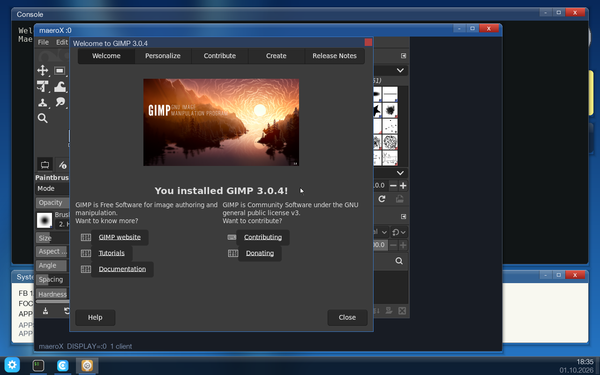

# Alpine X11 applications on maeroX

MaeroOS runs unmodified Alpine Linux x86 X11 programs (xterm, xeyes, xclock,
GTK 3 apps such as Mousepad and Galculator) as windows of maeroX, its X
server, and installs them from the desktop.

    make disk-alpinex      # disk-alpinex.img: Alpine root + offline X repo + /disk/xapp
    make smoke-alpinex     # opt-in: install, run, type into and close xterm, xeyes,
                           # mousepad (type + save) and galculator (7*6=)

Boot the ISO with `disk-alpinex.img` as the disk.  The Start menu then has
**Linux Apps**, which lists the curated applications with Install/Remove and
Open buttons.  Installed apps also get their own Start-menu entry.

## Pieces

| Piece | Where | What it does |
|---|---|---|
| maeroX | `userspace/maerox/` (initrd `/maerox`) | the X server, one desktop window whose body is the X screen |
| `xapp` | `userspace/xapp/xapp.c`, set-uid root at `/disk/xapp` | `list`, `install`, `remove`, `run`, `<slot> <name>` |
| Linux Apps | `userspace/xapp/linuxapps.c` (initrd `/linuxapps`) | the front end; runs `xapp install/remove`, launches entries |
| curated list | `userspace/xapp/xapps.h` | name, packages, command of each app |
| image | `ports/alpine/prepare.py` with `ALPINE_X=1` | adds `apk fetch -R` of the apps to `/repo/main` and `/repo/community`, pinned in `ports/alpine/alpine-x.lock` |

`xapp install <name>` runs `apk add` for the app's packages inside
`chroot /disk/alpine` (apk verifies the repo's signatures) and writes
`/disk/apps/<name>/manifest` with `exec=/disk/xapp args=<name>`, then tells
the desktop `apps-changed`.  Launching the entry runs `/disk/xapp <slot> <name>`:
if no X server answers, that process drops to the caller's uid and becomes
maeroX in the slot, and a child enters the chroot, drops privileges for good
and executes the app with `DISPLAY=:0`.  If maeroX already runs, the app
just joins it.  The app's output goes to `/disk/alpine/tmp/xapp-<name>.log`.

Privilege: `chroot` and `apk` need root, so `xapp` is set-uid (the initrd
cannot carry set-uid files, so it lives on the image).  It accepts only the
names in `xapps.h` — no package names, paths or commands from the caller — and
apps always run as the caller.  As root it touches only root-owned places
(the root's passwd/group via an O_EXCL temporary and rename, a freshly made
home under /home, /disk/apps with O_NOFOLLOW, the desktop FIFO); the log in
the chroot's 1777 /tmp, the runtime dir and ~/.config etc. are made after the
privilege drop.  `xappattack` (run by smoke-alpinex) plants a local user's
symlinks to root-owned canaries in those places and checks xapp leaves them
alone; the xapp before this fix failed all three.

The chroot's `/tmp` is its own, so the filesystem socket
`/tmp/.X11-unix/X0` is invisible inside it.  maeroX also listens on the
abstract socket `@/tmp/.X11-unix/X0`, which libxcb tries first; abstract
names are not part of any filesystem, so they cross the chroot.

## maeroX

maeroX was a Firefox-only server (absolute window coordinates, every event
sent whether selected or not, empty properties, no core text).  It now
implements the core protocol the way X11R7.7 specifies it, minus the parts
noted below:

- **windows**: a real tree (relative coordinates, borders, stacking,
  Configure/Reparent/Circulate, Map/Unmap/MapSubwindows, Destroy with
  DestroyNotify for the subtree), backgrounds (pixel, pixmap tile,
  ParentRelative), every window with its own backing buffer, composited
  bottom-up — so Expose is only needed on map and resize;
- **events**: per-client event masks, propagation and do-not-propagate,
  implicit and active pointer grabs (owner-events), keyboard grabs,
  Enter/Leave with the Ancestor/Inferior/Nonlinear/Virtual details,
  FocusIn/FocusOut, PropertyNotify, Selection*, ClientMessage, SendEvent,
  NoExpose after CopyArea/CopyPlane;
- **properties, atoms, selections**: all requests, predefined atoms 1-68;
- **drawing**: every core graphics request through one span rasteriser with
  the GC's function, plane mask, fill style (solid, tiled, stippled,
  opaque-stippled), clip rectangles or clip mask; wide lines, arcs, polygons
  (even-odd and winding); PutImage/GetImage in bitmap/XY/Z formats at depth
  1, 8, 24 and 32 (GetImage of a window includes its children);
- **fonts**: one built-in 8x16 face under XLFD names (medium, bold,
  iso8859-1, iso10646-1, "fixed", "8x16", "cursor"); OpenFont gives it for
  any name; QueryFont, ListFonts(WithInfo), QueryTextExtents, Poly/ImageText;
- **colours**: TrueColor; AllocColor, AllocNamedColor/LookupColor with the
  X.Org rgb.txt names, QueryColors;
- **RENDER 0.11**: formats a8r8g8b8, x8r8g8b8, a8, a1; Composite with every
  Porter-Duff operator, masks (and component alpha), transforms with nearest
  or bilinear filtering, repeat none/normal/pad/reflect, picture clips;
  solid, linear, radial and conical gradients; anti-aliased Trapezoids,
  Triangles, TriStrip, TriFan and AddTraps; glyph sets in A1/A8/ARGB32;
- **window manager** (in the server): toplevels get a frame with a title
  bar and a close box (WM_DELETE_WINDOW, else KillClient), are placed in a
  cascade or centred on their WM_TRANSIENT_FOR, can be dragged by the title,
  raise and take the focus on a click (WM_TAKE_FOCUS honoured);
  _NET_ACTIVE_WINDOW, _NET_CLOSE_WINDOW and _NET_WM_STATE maximise requests
  sent to the root are acted on.  `-k` (kiosk, used by Firefox's `ff`
  launcher) keeps the old behaviour: a large toplevel fills the screen,
  no frames.

Input: the desktop sends maeroX the raw pointer stream it asks for with
`rawptr` (every motion, all three buttons, leaving the window; libgui
`gui_set_ptr_handler`), the uncooked key stream, and wheel notches (buttons
4/5).  Unknown requests get BadRequest and are logged once to
`/tmp/maerox.log`, as are the extensions clients query.

Request trace: `maerox -x`, or `touch /tmp/.maerox-xtrace` before an app
connects, logs every request (`c2 #173 MapWindow len=8`), reply, event and
error per client to `/tmp/maerox.log` — the last request of a client that
stalls is the first thing to read.  `ps` plus an NMI (`inject-nmi` in the
QEMU monitor) shows which syscall each of its threads sleeps in.

`tools/maerox-host/run.sh` builds maeroX for the Linux build host (a stub
libgui with a control FIFO and PPM screen dumps) and runs it with an app from
an Alpine root in private namespaces: a protocol problem shows up there in
seconds; one that does not is the guest's (Mousepad mapped on the host at
once while it hung in the guest, which led to membarrier).

Not implemented (clients fall back): XKEYBOARD, XInputExtension, RANDR,
SHAPE, MIT-SHM, BIG-REQUESTS, XFIXES, DAMAGE, Composite, SYNC, GLX.  Window
gravity on parent resize, dashed lines and cursor images are ignored (the
desktop draws its own pointer).

## Applications

Measured on KVM with `make smoke-alpinex` (xterm, xeyes, Mousepad,
Galculator) and by hand on a development image with every app preinstalled
(`ALPINE_X=1 ALPINE_X_EXTRA="feh ristretto mpv gimp adwaita-icon-theme"
ALPINE_IMG=build/disk-alpinex-full.img python3 ports/alpine/prepare.py`).

| App | Status | Evidence |
|---|---|---|
| xterm | **works** | prompt, typed `echo typed-in-xterm > /tmp/xt.txt` runs in its shell (smoke) |
| xeyes | **works** | pupils follow the pointer, 4.6% of the window changes (smoke) |
| Mousepad (GTK 3) | **works** | maps in ~5 s, typed text, Ctrl+S, name typed into the GTK save dialog, Enter: file saved with the text (smoke) |
| Galculator (GTK 3) | **works** | installed in the guest by `xapp install` (~37 s); 7 * 6 Enter shows 42 (smoke) |
| feh | **works** | shows its sample images in a 640x480 window |
| Ristretto (GTK 3) | **works** | window, toolbar, image; it opens its own 128x128 icon (it was given the hicolor directory, which holds no image at its top level) |
| mpv | **works, with sound** | plays `/usr/share/sounds/alsa/Front_Center.wav` through ALSA (`AO: [alsa] 48000Hz mono`, the HDA output captured by QEMU peaks at 15487); X11 output via plain Xlib (no MIT-SHM) |
| GIMP 3.0.4 | **works** | main window, toolbox, brushes and the "Welcome to GIMP" dialog in ~45 s; plug-ins start; GIMP had crashed maeroX before the frame-blit fix |

What it took, besides maeroX itself:

- `membarrier(2)` in the kernel.  musl's dlopen() of a library with TLS
  issues MEMBARRIER_CMD_PRIVATE_EXPEDITED; without the syscall musl signals
  every thread and waits for each on a semaphore while holding the thread-list
  lock, and a thread blocked on that lock (with its signals blocked) never
  answers: Mousepad hung before mapping its window.
- O_NONBLOCK honoured on device reads and writes (-EAGAIN), and FIONBIO:
  xterm slept in a read of its pty master and stopped serving X events.
- Linux controlling-terminal rules for ptys: opening the slave without
  O_NOCTTY makes it a session leader's controlling tty, TIOCSCTTY takes the
  foreground group, job-control stops apply only to one's own ctty.  xterm's
  shell was stopped with no tty.
- xapp names the desktop user in the root's passwd/group (GLib's getpwuid)
  and creates ~/.config, ~/.cache, ~/.local/share.

The extensions maeroX lacks (see above) cost none of these apps more than a
fallback (mpv: no MIT-SHM, plain XPutImage).  No D-Bus session bus (`DBUS_SESSION_BUS_ADDRESS=disabled:`): Ristretto's thumbnails
and Xfconf settings, GIMP's single-instance check are off.  GLib has no file
monitor (no inotify).  apk in the guest is slow for big packages (~35 s for
Galculator alone, minutes for the GTK/ICU stack), which is why Mousepad's GTK
stack is preinstalled on the image.
